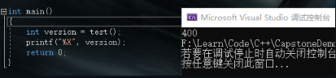
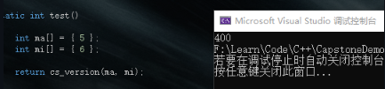
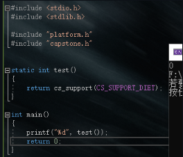
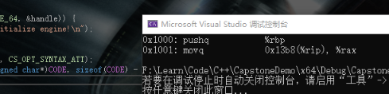
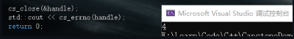
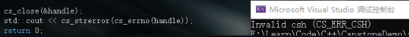
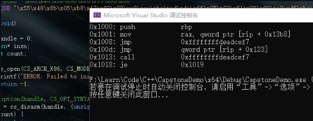
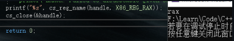

# **Capstone-Engine API Documentation**
*V4.0.2*

*Official API document by [kabeor*](https://github.com/kabeor)*

*Translated by Marius aka OSPFvX.*
# Capstone Engine is a binary disassembly engine that supports multiple hardware architectures.
# **0x0 development preparation**
**Capstone official website: [http://www.capstone-engine.org**](http://www.capstone-engine.org)**

**Compile lib and dll methods by yourself**

**Source code: [https://github.com/capstone-engine/capstone.git**](https://github.com/capstone-engine/capstone.git)**

**The file structure of git clone is as follows：**


**The following demonstrates that Windows10 is compiled using Visual Studio2019**

**Copy the msvc folder to a more refreshing location, the internal structure is as follows：**


**;EU - VS open capstone.sln project files, the solution automatically loads these:**

**;RU – Откройте в VS capstone.sln и solution автоматически загрузит этоЖ**


**;EU - You can see that all the supported languages are here. If you need them all, just compile them directly. Only a few of them are needed. Then right-click solution->Properties->Configure the properties as follows:**

**;RU - Вы можете видеть, что здесь представлены все поддерживаемые языки. Если они вам нужны все, просто скомпилируйте их напрямую. Нужны лишь некоторые из них. Затем щелкните правой кнопкой мыши solution->Properties->Настройте свойства следующим образом:**


**;EU - Check the support items you need in the build options to compile and capstone will be generated in the Debug directory of the current folder.lib static compilation library and capstone.dll dynamic library so that you can start using Capstone for development.**

**;RU - Проверьте необходимые элементы поддержки в параметрах сборки для компиляции, и capstone будет сгенерирован в каталоге Debug текущей folder.lib  статической компиляции lib и capstone.dll, чтобы вы могли начать использовать Capstone для разработки.**

**If you don't want to compile by yourself, the official compiled version is also provided**

**Win32： https://github.com/capstone-engine/capstone/releases/download/4.0.2/capstone-4.0.2-win32.zip**

**Win64： https://github.com/capstone-engine/capstone/releases/download/4.0.2/capstone-4.0.2-win64.zip**

**Choosing x32 or x64 will affect the number of digits developed later**


## *Engine call test*
**Create a new VS project, copy all the header files in capstone\include\capstone and the compiled lib and dll files to the home directory of the new project**


**In the VS solution, the header file adds the existing item capstone.h, add capstone to the resource file.lib, regenerate the solution**


**So let's test our own capstone engine now**

**Write the following code to the main file**

**Code:**
``` cpp

#include <iostream>

#include <stdio.h>

#include <cinttypes>  

#include "capstone.h"

using namespace std;

#define CODE "\x55\x48\x8b\x05\xb8\x13\x00\x00"

int main(void)

{

`	`csh handle;

`	`cs\_insn\* insn;

`	`size\_t count;

`	`if (cs\_open(CS\_ARCH\_X86, CS\_MODE\_64, &handle)) {

`		`printf("ERROR: Failed to initialize engine!\n");

`		`return -1;

`	`}

`	`count = cs\_disasm(handle, (unsigned char\*)CODE, sizeof(CODE) - 1, 0x1000, 0, &insn);

`	`if (count) {

`		`size\_t j;

`		`for (j = 0; j < count; j++) {

`			`printf("0x%""Ix"":\t%s\t\t%s\n", insn[j].address, insn[j].mnemonic, insn[j].op\_str);

`		`}

`		`cs\_free(insn, count);

`	`}

`	`else

`		`printf("ERROR: Failed to disassemble given code!\n");

`	`cs\_close(&handle);

`	`return 0;

}
```

**Result:**


# **0x1 data type**
## **csh** 
***-* Used to generate a handle to call the capstone API**

size\_t csh

**Note: csh handle;**
## **cs\_arch**
**-Architecture selection**

**Code:**
``` cpp
enum cs\_arch {

`	`CS\_ARCH\_ARM = 0,	///< ARM ( Thumb, Thumb-2)

`	`CS\_ARCH\_ARM64,		///< ARM-64, AArch64

`	`CS\_ARCH\_MIPS,		///< Mips 

`   `CS\_ARCH\_X86,		///< X86  ( x86 & x86-64)

`	`CS\_ARCH\_PPC,		///< PowerPC 

`	`CS\_ARCH\_SPARC,		///< Sparc 

`	`CS\_ARCH\_SYSZ,		///< SystemZ 

`	`CS\_ARCH\_XCORE,		///< XCore 

`	`CS\_ARCH\_M68K,		///< 68K 

`	`CS\_ARCH\_TMS320C64X,	///< TMS320C64x 

`	`CS\_ARCH\_M680X,		///< 680X 

`	`CS\_ARCH\_EVM,		///< Ethereum 

`	`CS\_ARCH\_MAX,

`	`CS\_ARCH\_ALL = 0xFFFF, // All architecture - for cs\_support()

} cs\_arch;
```
**Note: Fill in the enumeration content for the cs\_arch parameter in the API, such as cs\_open (cs\_arch arch, cs\_mode mode, csh \*handle) in the API; fill in CS\_ARCH\_X86 for the first parameter to support the X86 architecture**
## **cs\_mode**
**-** **Mode selection**

``` cpp
enum cs\_mode {

`	`CS\_MODE\_LITTLE\_ENDIAN = 0,	             ///< little-endian 模式 (default 模式)

`	`CS\_MODE\_ARM = 0,	                     ///< 32-bit ARM

`	`CS\_MODE\_16 = 1 << 1,	                 ///< 16-bit 模式 (X86)

`	`CS\_MODE\_32 = 1 << 2,	                 ///< 32-bit 模式 (X86)

`	`CS\_MODE\_64 = 1 << 3,	                 ///< 64-bit 模式 (X86, PPC)

`	`CS\_MODE\_THUMB = 1 << 4,	                 ///< ARM's Thumb 模式, 包括 Thumb-2

`	`CS\_MODE\_MCLASS = 1 << 5,	             ///< ARM's Cortex-M 系列

`	`CS\_MODE\_V8 = 1 << 6,	                 ///< ARMv8 A32解码方式

`	`CS\_MODE\_MICRO = 1 << 4,                  ///< MicroMips 模式 (MIPS)

`	`CS\_MODE\_MIPS3 = 1 << 5,                  ///< Mips III ISA

`	`CS\_MODE\_MIPS32R6 = 1 << 6,               ///< Mips32r6 ISA

`	`CS\_MODE\_MIPS2 = 1 << 7,                  ///< Mips II ISA

`	`CS\_MODE\_V9 = 1 << 4,                     ///< SparcV9 模式 (Sparc)

`	`CS\_MODE\_QPX = 1 << 4,                    ///< Quad Processing eXtensions 模式 (PPC)

`	`CS\_MODE\_SPE = 1 << 5,                    ///< Signal Processing Engine 模式 (PPC)

`	`CS\_MODE\_BOOKE = 1 << 6,                  ///< Book-E 模式 (PPC)

`	`CS\_MODE\_M68K\_000 = 1 << 1,               ///< M68K 68000 模式

`	`CS\_MODE\_M68K\_010 = 1 << 2,               ///< M68K 68010 模式

`	`CS\_MODE\_M68K\_020 = 1 << 3,               ///< M68K 68020 模式

`	`CS\_MODE\_M68K\_030 = 1 << 4,               ///< M68K 68030 模式

`	`CS\_MODE\_M68K\_040 = 1 << 5,               ///< M68K 68040 模式

`	`CS\_MODE\_M68K\_060 = 1 << 6,               ///< M68K 68060 模式

`	`CS\_MODE\_BIG\_ENDIAN = 1 << 31,	         ///< big-endian 模式

`	`CS\_MODE\_MIPS32 = CS\_MODE\_32,	         ///< Mips32 ISA (Mips)

`	`CS\_MODE\_MIPS64 = CS\_MODE\_64,	         ///< Mips64 ISA (Mips)

`	`CS\_MODE\_M680X\_6301 = 1 << 1,             ///< M680X Hitachi 6301,6303 模式

`	`CS\_MODE\_M680X\_6309 = 1 << 2,             ///< M680X Hitachi 6309 模式

`	`CS\_MODE\_M680X\_6800 = 1 << 3,             ///< M680X Motorola 6800,6802 模式

`	`CS\_MODE\_M680X\_6801 = 1 << 4,             ///< M680X Motorola 6801,6803 模式

`	`CS\_MODE\_M680X\_6805 = 1 << 5,             ///< M680X Motorola/Freescale 6805 模式

`	`CS\_MODE\_M680X\_6808 = 1 << 6,             ///< M680X Motorola/Freescale/NXP 68HC08 模式

`	`CS\_MODE\_M680X\_6809 = 1 << 7,             ///< M680X Motorola 6809 模式

`	`CS\_MODE\_M680X\_6811 = 1 << 8,             ///< M680X Motorola/Freescale/NXP 68HC11 模式

`	`CS\_MODE\_M680X\_CPU12 = 1 << 9,            ///< M680X Motorola/Freescale/NXP CPU12

`					                         `///< 用于 M68HC12/HCS12

`	`CS\_MODE\_M680X\_HCS08 = 1 << 10,           ///< M680X Freescale/NXP HCS08 模式

`	`CS\_MODE\_BPF\_CLASSIC = 0,	             ///< Classic BPF 模式 (默认)

`	`CS\_MODE\_BPF\_EXTENDED = 1 << 0,	         ///< Extended BPF 模式

`	`CS\_MODE\_RISCV32  = 1 << 0,               ///< RISCV RV32G

`	`CS\_MODE\_RISCV64  = 1 << 1,               ///< RISCV RV64G

`	`CS\_MODE\_RISCVC   = 1 << 2,               ///< RISCV 压缩指令模式

`	`CS\_MODE\_MOS65XX\_6502 = 1 << 1,           ///< MOS65XXX MOS 6502

`	`CS\_MODE\_MOS65XX\_65C02 = 1 << 2,          ///< MOS65XXX WDC 65c02

`	`CS\_MODE\_MOS65XX\_W65C02 = 1 << 3,         ///< MOS65XXX WDC W65c02

`	`CS\_MODE\_MOS65XX\_65816 = 1 << 4,          ///< MOS65XXX WDC 65816, 8-bit m/x

`	`CS\_MODE\_MOS65XX\_65816\_LONG\_M = (1 << 5), ///< MOS65XXX WDC 65816, 16-bit m, 8-bit x 

`	`CS\_MODE\_MOS65XX\_65816\_LONG\_X = (1 << 6), ///< MOS65XXX WDC 65816, 8-bit m, 16-bit x

`	`CS\_MODE\_MOS65XX\_65816\_LONG\_MX = CS\_MODE\_MOS65XX\_65816\_LONG\_M | CS\_MODE\_MOS65XX\_65816\_LONG\_X,

} cs\_mode;
```
**Note: Fill in the enumeration content for the cs\_mode parameter in the API, such as cs\_open (cs\_arch arch, cs\_mode mode, csh \*handle) in the API; fill in CS\_MODE\_64 for the second parameter to support X64 mode**
## cs\_opt\_mem
-Memory operation
``` cpp
struct cs\_opt\_mem {

`	`cs\_malloc\_t malloc;

`	`cs\_calloc\_t calloc;

`	`cs\_realloc\_t realloc;

`	`cs\_free\_t free;

`	`cs\_vsnprintf\_t vsnprintf;

} cs\_opt\_mem;
```
Note: You can use the user-defined malloc/calloc/realloc/free/vsnprintf() function. By default, the system comes with malloc (), calloc(), realloc(), free() & vsnprintf().
## cs\_opt\_mnem
\- Custom mnemonics
``` cpp
struct cs\_opt\_mnem {

`	`/// Need a custom instruction ID

`	`unsigned int id;

`	`/// Custom mnemonics

`	`const char \*mnemonic;

} cs\_opt\_mnem;
```
## cs\_opt\_type
-Decompiled runtime options
``` cpp
enum cs\_opt\_type {

`	`CS\_OPT\_INVALID = 0,   //No special requirements

`	`CS\_OPT\_SYNTAX,	    //Assembly output syntax

`	`CS\_OPT\_DETAIL,	   //Break down the instruction structure into multiple details

`	`CS\_OPT\_MODE,	  //Change engine mode at runtime

`	`CS\_OPT\_MEM,	 //User-defined dynamic memory-related functions

`	`CS\_OPT\_SKIPDATA, //Skip data when disassembling.Then the engine will be in SKIPDATA mode

`	`CS\_OPT\_SKIPDATA\_SETUP,  //Set user-defined functions for the SKIPDATA option

`	`CS\_OPT\_MNEMONIC,        //Custom instruction mnemonics

`	`CS\_OPT\_UNSIGNED,        //Print immediate operands in unsigned form

} cs\_opt\_type;
```
**Not called in the currently open API**
## **cs\_ac\_type**
-Common instruction operand access types, consistent in all architectures, access types can be combined, for example: CS\_AC\_READ | CS\_AC\_WRITE

Code:
``` cpp
enum cs\_ac\_type {

`	`CS\_AC\_INVALID = 0,        //Uninitialized/invalid access type

`	`CS\_AC\_READ    = 1 << 0,   //The operand is read from memory or register

`	`CS\_AC\_WRITE   = 1 << 1,   //The operand is written from memory or register

} cs\_ac\_type;
```
Not called in the currently open API

## cs\_group\_type
\- Common instruction set, consistent across all architectures

Code:
``` cpp
cs\_group\_type {

`	`CS\_GRP\_INVALID = 0,  //Uninitialized/invalid instruction set

`	`CS\_GRP\_JUMP,    //All jump instructions (conditional jump + direct jump + indirect jump)

`	`CS\_GRP\_CALL,    //All calling instructions

`	`CS\_GRP\_RET,     //All return instructions

`	`CS\_GRP\_INT,     //All interrupt instructions (INT+SYSCALL)

`	`CS\_GRP\_IRET,    //All interrupt return instructions

`	`CS\_GRP\_PRIVILEGE,    //All privileged instructions

`	`CS\_GRP\_BRANCH\_RELATIVE, //All relevant branch instructions

} cs\_group\_type;
```
Not called in the currently open API
## cs\_opt\_skipdata
-User-defined settings SKIPDATA options


Code:
``` cpp
struct cs\_opt\_skipdata {

`	`/// CAPSTONE BELIEVES THAT THE DATA TO BE SKIPPED IS A SPECIAL "INSTRUCTION”

`	`/// The user can specify the “mnemonic” string of the instruction here

`	`/// By DEFAULT (@MNEMONIC is NULL), CAPSTONE USES “.BYTE”

`	`const char \*mnemonic;

`	`/// User-DEFINED CALLBACK FUNCTION, CALLED when CAPSTONE HITS DATA

`	`/// IF THE VALUE RETURNED BY THIS CALLBACK IS A POSITIVE number (>0), CAPSTONE WILL SKIP THIS NUMBER OF BYTES AND CONTINUE.If the callback returns 0, CAPSTONE will stop disassembling and immediately return from CS\_DISASM()

`	`/// Note: If THIS CALLBACK POINTER IS EMPTY, CAPSTONE WILL SKIP SOME BYTES ACCORDING TO THE ARCHITECTURE, AS SHOWN BELOW:

`	`/// Arm:     2 bytes (Thumb mode) or 4 bytes.

`	`/// Arm64:   4 bytes.

`	`/// Mips:    4 bytes.

`	`/// M680x:   1 byte.

`	`/// PowerPC: 4 bytes.

`	`/// Sparc:   4 bytes.

`	`/// SystemZ: 2 bytes.

`	`/// X86:     1 bytes.

`	`/// XCore:   2 bytes.

`	`/// EVM:     1 bytes.

`	`/// RISCV:   4 bytes.

`	`/// WASM:    1 bytes.

`	`/// MOS65XX: 1 bytes.

`	`/// BPF:     8 bytes.

`	`cs\_skipdata\_cb\_t callback; 	// The default value is NULL

`	`/// User-defined data will be passed to the @CALLBACK function pointer

`	`void \*user\_data;

} cs\_opt\_skipdata;
```
Not called in the currently open API
## cs\_detail
-Note: All information in cs\_detail is only available when CS\_OPT\_DETAIL = CS\_OPT\_ON

In arch/ARCH/ARCHDisassembler.The ARCH\_getInstruction of c is initialized to memset (., 0, offsetof(cs\_detail, ARCH)+sizeof(cs\_ARCH))

If cs\_detail changes, especially if a field is added after union, then update arch/arch/archdisassembly accordingly.c


Code:
``` cpp
struct cs\_detail {

`	`uint16\_t regs\_read[16]; ///< This parameter reads the list of implicit registers

`	`uint8\_t regs\_read\_count; ///< This parameter reads the implicit register count

`	`uint16\_t regs\_write[20]; ///< This parameter modifies the list of implicit registers

`	`uint8\_t regs\_write\_count; ///< This parameter modifies the implicit register count

`	`uint8\_t groups[8]; ///< List of instruction groups to which this instruction belongs

`	`uint8\_t groups\_count; ///< The number of groups to which this instruction belongs

`	`/// Architecture-specific information

`	`union {

`		`cs\_x86 x86;     ///< X86, 16-bit, 32-bit & 64-bit

`		`cs\_arm64 arm64; ///< ARM64(aka AArch64)

`		`cs\_arm arm;     ///< ARM(Thumb/Thumb2)

`		`cs\_m68k m68k;   ///< M68K

`		`cs\_mips mips;   ///< MIPS

`		`cs\_ppc ppc;	    ///< PowerPC 

`		`cs\_sparc sparc; ///< Sparc 

`		`cs\_sysz sysz;   ///< SystemZ 

`		`cs\_xcore xcore; ///< XCore 

`		`cs\_tms320c64x tms320c64x;  ///< TMS320C64x 

`		`cs\_m680x m680x; ///< M680X 

`		`cs\_evm evm;	    ///< Ethereum 

`		`cs\_mos65xx mos65xx;	///< MOS65XX(MOS6502)

`		`cs\_wasm wasm;	///< Web Assembly 

`		`cs\_bpf bpf;	///< Berkeley Packet Filter (eBPF)

`		`cs\_riscv riscv; ///< RISCV

`	`};

} cs\_detail;
```


## cs\_insn
\- Instruction details

Code:
``` cpp
struct cs\_insn {

`	`/// Instruction ID (basically a numeric ID used for instruction mnemonics)

`	`/// The instruction ID IN'[ARCH]\_INSN'ENUM SHOULD BE FOUND IN THE HEADER FILE OF THE CORRESPONDING architecture, SUCH AS ARM.The'ARM\_INSN' in H represents ARM, X86.The 'X86\_INSN' in H represents X86, ETC.…

`	`/// This information can be used even when CS\_OPT\_DETAIL = CS\_OPT\_OFF

`	`/// Note: In SKIPDATA mode, the “DATA” command for this ID field is 0

`	`unsigned int id;

`	`/// Instruction address (EIP)

`	`/// This information can be used even when CS\_OPT\_DETAIL = CS\_OPT\_OFF

`	`uint64\_t address;

`	`/// Instruction length

`	`/// This information can be used even when CS\_OPT\_DETAIL = CS\_OPT\_OFF

`	`uint16\_t size;

`	`/// The machine code of this instruction, the number of bytes is represented by the @SIZE above

`	`/// This information can be used even when CS\_OPT\_DETAIL = CS\_OPT\_OFF

`	`uint8\_t bytes[24];

`	`/// ASCII text mnemonic for instructions

`	`/// This information can be used even when CS\_OPT\_DETAIL = CS\_OPT\_OFF

`	`char mnemonic[CS\_MNEMONIC\_SIZE];

`	`/// ASCII text for instruction operands

`	`/// This information can be used even when CS\_OPT\_DETAIL = CS\_OPT\_OFF

`	`char op\_str[160];

`	`/// CS\_DETAIL pointer

`	`/// Note: The DETAIL pointer is only valid if the following two requirements are met at the same time:

`	`/// (1) CS\_OP\_DETAIL = CS\_OPT\_ON

`	`/// (2) The engine is not in SKIPDATA mode (the CS\_OP\_SKIPDATA option is set to CS\_OPT\_ON)

`	`/// Note 2: When in SKIPDATA mode or DETAIL mode is turned off, even if this pointer is not NULL, its content is still irrelevant.

`	`cs\_detail \*detail;

} cs\_insn;
```
## cs\_err
-The return value of cs\_errno() for various types of errors encountered by the Capstone API


Code:
``` cpp
typedef enum cs\_err {

`	`CS\_ERR\_OK = 0,    ///< No error

`	`CS\_ERR\_MEM,       ///< Insufficient memory: CS\_OPEN(), CS\_DISASM(), CS\_DISASM\_ITER()

`	`CS\_ERR\_ARCH,      ///< Unsupported architecture: CS\_OPEN()

`	`CS\_ERR\_HANDLE,    ///< The handle is not available: CS\_OP\_DATA(), CS\_OP\_INDEX()

`	`CS\_ERR\_CSH, //CSH parameters are not available: CS\_CLOSE(), CS\_ERRNO(), CS\_OPTION()

`	`CS\_ERR\_MODE,      ///< Invalid or unsupported mode: CS\_OPEN()

`	`CS\_ERR\_OPTION,    ///< Invalid or unsupported options: CS\_OPTION()

`	`CS\_ERR\_DETAIL,    ///< The information is not available because the DETAIL option is turned off

`	`CS\_ERR\_MEMSETUP,  //Dynamic memory management is not initialized (see CS\_OPT\_MEM)

`	`CS\_ERR\_VERSION,   ///< UNSUPPORTED version (BINDINGS)

`	`CS\_ERR\_DIET,      ///< Access irrelevant data in the ”DIET" engine

`	`CS\_ERR\_SKIPDATA,  ///< Access data unrelated to the “Data” instruction in SKIPDATA mode

`	`CS\_ERR\_X86\_ATT,   ///< X86 AT&T syntax is not supported (exit at compile time)

`	`CS\_ERR\_X86\_INTEL, ///< X86 INTEL syntax is not supported (exit at compile time)

`	`CS\_ERR\_X86\_MASM,  ///< X86 INTEL syntax is not supported (exit at compile time)

} cs\_err;
```
# **0x2 API**
## cs\_version
unsigned int CAPSTONE\_API cs\_version(int \*major, int \*minor);

Used to output the capstone version number:

Major: API main version

Minor: API minor version

Return: Returns the hexadecimal of the primary and secondary versions, such as version 4.0 returns 0x0400

This version is defined in cs.In c, it cannot be changed after compilation, and custom versions are not accepted


Code:
``` cpp
#include <stdio.h>

#include <stdlib.h>

#include "platform.h"

#include "capstone.h"

static int test()

{

`	`return cs\_version(NULL, NULL);	

}

int main()

{

`	`int version = test();

`	`printf("%X", version);

`	`return 0;

}
```

``` cpp


Example 2, forcibly modify the version:

#include <stdio.h>

#include <stdlib.h>

#include "platform.h"

#include "capstone.h"

static int test()

{

`	`int ma[] = { 5 };

`	`int mi[] = { 6 };

`	`return cs\_version(ma, mi);	

}

int main()

{

`	`int version = test();

`	`printf("%X", version);

`	`return 0;

}
```


Visible and cannot be changed
## cs\_support
bool CAPSTONE\_API cs\_support(int query);

Used to check whether the capstone library supports the architecture of parameter input or is in a certain compilation option


Code:
``` cpp
bool CAPSTONE\_API cs\_support(int query)

{

`	`if (query == CS\_ARCH\_ALL)

`		`return all\_arch == ((1 << CS\_ARCH\_ARM) | (1 << CS\_ARCH\_ARM64) |

`				`(1 << CS\_ARCH\_MIPS) | (1 << CS\_ARCH\_X86) |

`				`(1 << CS\_ARCH\_PPC) | (1 << CS\_ARCH\_SPARC) |

`				`(1 << CS\_ARCH\_SYSZ) | (1 << CS\_ARCH\_XCORE) |

`				`(1 << CS\_ARCH\_M68K) | (1 << CS\_ARCH\_TMS320C64X) |

`				`(1 << CS\_ARCH\_M680X) | (1 << CS\_ARCH\_EVM));

`	`if ((unsigned int)query < CS\_ARCH\_MAX)

`		`return all\_arch & (1 << query);

`	`if (query == CS\_SUPPORT\_DIET) {

#ifdef CAPSTONE\_DIET

`		`return true;

#else

`		`return false;

#endif

`	`}

`	`if (query == CS\_SUPPORT\_X86\_REDUCE) {

#if defined(CAPSTONE\_HAS\_X86) && defined(CAPSTONE\_X86\_REDUCE)

`		`return true;

#else

`		`return false;

#endif

`	`}

`	`// unsupported query

`	`return false;

}
```
Example 1 (CS\_ARCH\_ALL, check whether all architectures are supported)


Example 2 (CS\_ARCH\_\*, check whether the specified architecture is supported) 

Example 3 (check if it is in DIET compilation mode)：



Example 4 (check if it is in X86\_REDUCE compilation mode):


## cs\_malloc\_t
void\* (CAPSTONE\_API \*cs\_malloc\_t)(size\_t size);

Dynamic memory allocation of cs, used for
``` cpp
struct cs\_opt\_mem {

`	`cs\_malloc\_t malloc;

`	`cs\_calloc\_t calloc;

`	`cs\_realloc\_t realloc;

`	`cs\_free\_t free;

`	`cs\_vsnprintf\_t vsnprintf;

} cs\_opt\_mem;
```
In user mode, cs\_mem\_malloc uses system malloc by default

In Windows driver mode, cs\_malloc\_t cs\_mem\_malloc = cs\_winkernel\_malloc;

cs\_winkernel\_malloc is defined in \capstone-4.0.1\windows\winkernel\_mm.c,

Code:
``` cpp
void \* CAPSTONE\_API cs\_winkernel\_malloc(size\_t size)

{

`	`// 长度不能分配为0

`	`NT\_ASSERT(size);

`	`// FP; NonPagedPool用于支持 Windows 7 

#pragma prefast(suppress : 30030)		// 分配可执行的POOL\_TYPE内存

`	`size\_t number\_of\_bytes = 0;

`	`CS\_WINKERNEL\_MEMBLOCK \*block = NULL;

`	`// 特定的值能造成溢出

`	`// 如果value中的和超出或低于类型容量，函数将返回NULL。

`	`if (!NT\_SUCCESS(RtlSizeTAdd(size, sizeof(CS\_WINKERNEL\_MEMBLOCK), &number\_of\_bytes))) {

`		`return NULL;

`	`}

`	`block = (CS\_WINKERNEL\_MEMBLOCK \*)ExAllocatePoolWithTag(

`			`NonPagedPool, number\_of\_bytes, CS\_WINKERNEL\_POOL\_TAG);

`	`if (!block) {

`		`return NULL;

`	`}

`	`block->size = size;

`	`return block->data;

}
```
In OSX kernel mode, cs\_malloc\_t cs\_mem\_malloc = kern\_os\_malloc;, will not be discussed here for the time being.
## cs\_calloc\_t
void\* (CAPSTONE\_API \*cs\_calloc\_t)(size\_t nmemb, size\_t size);

cs applies for memory and initializes

Used for struct cs\_opt\_mem, defined in cs.c

User mode: cs\_calloc\_t cs\_mem\_calloc = calloc;, use system calloc

Windows driver mode: cs\_calloc\_t cs\_mem\_calloc = cs\_winkernel\_calloc;

Code:
``` cpp
void \* CAPSTONE\_API cs\_winkernel\_calloc(size\_t n, size\_t size)

{

`	`size\_t total = n \* size;

`	`void \*new\_ptr = cs\_winkernel\_malloc(total);

`	`if (!new\_ptr) {

`		`return NULL;

`	`}

`	`return RtlFillMemory(new\_ptr, total, 0);

}
```
OSX kernel mode: cs\_calloc\_t cs\_mem\_calloc = cs\_kern\_os\_calloc; directly call kern\_os\_malloc

## cs\_realloc\_t
void\* (CAPSTONE\_API \*cs\_realloc\_t)(void \*ptr, size\_t size);

cs reallocates memory

Used for struct cs\_opt\_mem, defined in cs.c

User mode: cs\_realloc\_t cs\_mem\_realloc= realloc;, call the system realloc

Windows driver mode: cs\_realloc\_t cs\_mem\_realloc = cs\_winkernel\_realloc;


Code:

void \* CAPSTONE\_API cs\_winkernel\_realloc(void \*ptr, size\_t size)
``` cpp
{

`	`void \*new\_ptr = NULL;

`	`size\_t current\_size = 0;

`	`size\_t smaller\_size = 0;

`	`if (!ptr) {

`		`return cs\_winkernel\_malloc(size);

`	`}

`	`new\_ptr = cs\_winkernel\_malloc(size);

`	`if (!new\_ptr) {

`		`return NULL;

`	`}

`	`current\_size = CONTAINING\_RECORD(ptr, CS\_WINKERNEL\_MEMBLOCK, data)->size;

`	`smaller\_size = (current\_size < size) ? current\_size : size;

`	`RtlCopyMemory(new\_ptr, ptr, smaller\_size);

`	`cs\_winkernel\_free(ptr);

`	`return new\_ptr;

}
```
OSX kernel mode: cs\_realloc\_t cs\_mem\_realloc = kern\_os\_realloc;
## cs\_free\_t
typedef void (CAPSTONE\_API \*cs\_free\_t)(void \*ptr);

cs frees up memory

Used for struct cs\_opt\_mem, defined in cs.c

User mode: cs\_free\_t cs\_mem\_free =free;, call the system free

Windows driver mode: cs\_free\_t cs\_mem\_free = cs\_winkernel\_free;

void CAPSTONE\_API cs\_winkernel\_free(void \*ptr)

{

`	`if (ptr) {

`		`ExFreePoolWithTag(CONTAINING\_RECORD(ptr, CS\_WINKERNEL\_MEMBLOCK, data), CS\_WINKERNEL\_POOL\_TAG);

`	`}

}

OSX kernel mode: cs\_free\_t cs\_mem\_free = kern\_os\_free;

## cs\_vsnprintf\_t
int (CAPSTONE\_API \*cs\_vsnprintf\_t)(char \*str, size\_t size, const char \*format, va\_list ap);

Output to the string str by size

if the system is wince, the \_vsnprintf function will be used

vsnprintf () and \_vsnprintf() are both available for drivers, but they have some differences

Use vsnprintf() when you need to return a value and set a null terminator

Windows driver mode: cs\_vsnprintf\_t cs\_vsnprintf = cs\_winkernel\_vsnprintf;

int CAPSTONE\_API cs\_winkernel\_vsnprintf(char \*buffer, size\_t count, const char \*format, va\_list argptr)
```
{

`	`int result = \_vsnprintf(buffer, count, format, argptr);

`	    `// \_vsnprintf()Returns -1 when the string is truncated, and “COUNT” when the entire string is stored but there is no “\0” at the end of “BUFFER”.In both cases, you need to manually add a null terminator.

`	`if (result == -1 || (size\_t)result == count) {

`		`buffer[count - 1] = '\0';

`	`}

`	`if (result == -1) {

`		`// When returning -1, the function must obtain and return some characters that were originally to be written.THEREFORE, BY RETRY USING THE TEMP BUFFER FOR THE SAME CONVERSION, THIS BUFFER MAY BE LARGE ENOUGH TO COMPLETE THE FORMATTING AND GET A LOT OF CHARACTERS THAT SHOULD HAVE BEEN WRITTEN.

`		`char\* tmp = cs\_winkernel\_malloc(0x1000);

`		`if (!tmp) {

`			`return result;

`		`}

`		`result = \_vsnprintf(tmp, 0x1000, format, argptr);

`		`NT\_ASSERT(result != -1);

`		`cs\_winkernel\_free(tmp);

`	`}

`	`return result;

}
```
OSX kernel mode: cs\_vsnprintf\_t cs\_vsnprintf= vsnprintf;, use the default vsnprintf
## cs\_skipdata\_cb\_t
size\_t (CAPSTONE\_API \*cs\_skipdata\_cb\_t)(const uint8\_t \*code, size\_t code\_size, size\_t offset, void \*user\_data);

User-defined callback function for the SKIPDATA option.

Code: The input buffer that contains the code to be decomposed.Same as the buffer passed to cs\_disasm().

code\_size: The size of the code buffer above (in bytes).

offset: The position of the current check byte in the input buffer code mentioned above.

user\_data: User data is passed to cs\_option() through the @user\_data field in the cs\_opt\_skipdata structure.

Return: Returns the number of bytes to be skipped, or 0 means that disassembly is stopped immediately.

cs\_skipdata\_cb\_t is called in struct cs\_opt\_skipdata
### Code:
``` cpp
#include <stdio.h>

#include <stdlib.h>

#include "platform.h"

#include "capstone.h"

struct platform {

`	`cs\_arch arch;

`	`cs\_mode mode;

`	`unsigned char\* code;

`	`size\_t size;

`	`const char\* comment;

`	`cs\_opt\_type opt\_type;

`	`cs\_opt\_value opt\_value;

`	`cs\_opt\_type opt\_skipdata;

`	`size\_t skipdata;

};

static void print\_string\_hex(unsigned char\* str, size\_t len)  //Output machine code

{

`	`unsigned char\* c;

`	`printf("Code: ");

`	`for (c = str; c < str + len; c++) {

`		`printf("0x%02x ", \*c & 0xff);

`	`}

`	`printf("\n");

}

static void test()

{

#define X86\_CODE32 "\x8d\x4c\x32\x08\x01\xd8\x81\xc6\x34\x12\x00\x00\x00\x91\x92"  // //Machine code for testing

#define RANDOM\_CODE "\xed\x00\x00\x00\x00\x1a\x5a\x0f\x1f\xff\xc2\x09\x80\x00\x00\x00\x07\xf7\xeb\x2a\xff\xff\x7f\x57\xe3\x01\xff\xff\x7f\x57\xeb\x00\xf0\x00\x00\x24\xb2\x4f\x00\x78"

`	`cs\_opt\_skipdata skipdata = {

`		`// Change the default "DATA" descriptor from ".Rename "BYTE" To "DB" "DB",	};

`	`struct platform platforms[2] = {      //Create an array in two ways: default descriptors and custom descriptors

`		`{

`			`CS\_ARCH\_X86,

`			`CS\_MODE\_32,

`			`(unsigned char\*)X86\_CODE32,

`			`sizeof(X86\_CODE32) - 1,

`			`"X86 32 (Intel syntax) - Skip data",

`		`},

`		`{

`			`CS\_ARCH\_X86,

`			`CS\_MODE\_32,

`			`(unsigned char\*)X86\_CODE32,

`			`sizeof(X86\_CODE32) - 1,

`			`"X86 32 (Intel syntax) - Skip data with custom mnemonic",

`			`CS\_OPT\_INVALID,

`			`CS\_OPT\_OFF,

`			`CS\_OPT\_SKIPDATA\_SETUP,

`			`(size\_t)& skipdata,

`		`},

`	`};


`	`csh handle;   // Create a CAPSTONE handle

`	`uint64\_t address = 0x1000;  // Set  the  starting address

`	`cs\_insn\* insn;  // Specific information structure

`	`cs\_err err;  //Error enumeration

`	`int i;

`	`size\_t count;  //Number of successfully disassembled lines

`	`for (i = 0; i < sizeof(platforms) / sizeof(platforms[0]); i++) {

`		`printf("\*\*\*\*\*\*\*\*\*\*\*\*\*\*\*\*\n");

`		`printf("Platform: %s\n", platforms[i].comment);

`		`err = cs\_open(platforms[i].arch, platforms[i].mode, &handle);  //Error checking

`		`if (err) {

`			`printf("Failed on cs\_open() with error returned: %u\n", err);

`			`abort();

`		`}

`		`if (platforms[i].opt\_type)

`			`cs\_option(handle, platforms[i].opt\_type, platforms[i].opt\_value);

`		`// Turn on SKIPDATA mode

`		`cs\_option(handle, CS\_OPT\_SKIPDATA, CS\_OPT\_ON);

`		`cs\_option(handle, platforms[i].opt\_skipdata, platforms[i].skipdata);

`		`count = cs\_disasm(handle, platforms[i].code, platforms[i].size, address, 0, &insn);

`		`if (count) {

`			`size\_t j;

`			`print\_string\_hex(platforms[i].code, platforms[i].size);

`			`printf("Disasm:\n");

`			`for (j = 0; j < count; j++) {  // Output assembly

`				`printf("0x%" PRIx64 ":\t%s\t\t%s\n",

`					`insn[j].address, insn[j].mnemonic, insn[j].op\_str);

`			`}

`			`// Print the offset after the last line of code

`			`printf("0x%" PRIx64 ":\n", insn[j - 1].address + insn[j - 1].size);

`			`//Free up the memory requested by CS\_DISASM()

`			`cs\_free(insn, count);

`		`}

`		`else {

`			`printf("\*\*\*\*\*\*\*\*\*\*\*\*\*\*\*\*\n");

`			`printf("Platform: %s\n", platforms[i].comment);

`			`print\_string\_hex(platforms[i].code, platforms[i].size);

`			`printf("ERROR: Failed to disasm given code!\n");

`			`abort();

`		`}

`		`printf("\n");

`		`cs\_close(&handle);

`	`}

}

int main()

{

`	`test();

`	`return 0;

}
```
The running result is as follows, the default.The byte data type is changed to the db descriptor


## cs\_open
cs\_err CAPSTONE\_API cs\_open(cs\_arch arch, cs\_mode mode, csh \*handle);

Initialize the cs handle


arch: Architecture type (CS\_ARCH\_\*)

Mode: hardware mode. CS\_MODE\_\* can be found in the cs\_mode data type

handle: Points to the handle, updated when returned

Return: CS\_ERR\_OK is returned after successful creation, otherwise the corresponding error message in the cs\_err enumeration is returned


### Code:
``` cpp

cs\_err CAPSTONE\_API cs\_open(cs\_arch arch, cs\_mode mode, csh \*handle)

{

`	`cs\_err err;

`	`struct cs\_struct \*ud;

`	`if (!cs\_mem\_malloc || !cs\_mem\_calloc || !cs\_mem\_realloc || !cs\_mem\_free || !cs\_vsnprintf)

// ERROR: Before using CS\_OPEN(), you must use CS\_OPTION(CS\_OPT\_MEM) to initialize dynamic //memory management

`		`return CS\_ERR\_MEMSETUP;

`	`if (arch < CS\_ARCH\_MAX && cs\_arch\_init[arch]) {

`		`// Verify whether the architecture is used, method: The architecture is in the //enumeration and can be initialized

`		`if (mode & cs\_arch\_disallowed\_mode\_mask[arch]) {

`			`\*handle = 0;

`			`return CS\_ERR\_MODE;

`		`}

`		`ud = cs\_mem\_calloc(1, sizeof(\*ud));

`		`if (!ud) {

`			`// Insufficient memory

`			`return CS\_ERR\_MEM;

`		`}

`		`ud->errnum = CS\_ERR\_OK;

`		`ud->arch = arch;

`		`ud->mode = mode;

`		`// By default, the command does not turn on the DETAIL mode

`		`ud->detail = CS\_OPT\_OFF;

`		`// Default SKIPDATA setting

`		`ud->skipdata\_setup.mnemonic = SKIPDATA\_MNEM;

`		`err = cs\_arch\_init[ud->arch](ud);

`		`if (err) {

`			`cs\_mem\_free(ud);

`			`\*handle = 0;

`			`return err;

`		`}

`		`\*handle = (uintptr\_t)ud;

`		`return CS\_ERR\_OK;

`	`} else {

`		`\*handle = 0;

`		`return CS\_ERR\_ARCH;

`	`}

}
```


Among them, the cs\_struct structure contains more detailed settings, as follows:

Code:
``` cpp
struct cs\_struct {

`	`cs\_arch arch;

`	`cs\_mode mode;

`	`Printer\_t printer;	// Print ASM

`	`void \*printer\_info; // Print information

`	`Disasm\_t disasm;	// Decompile

`	`void \*getinsn\_info; // Print auxiliary information

`	`GetName\_t reg\_name;

`	`GetName\_t insn\_name;

`	`GetName\_t group\_name;

`	`GetID\_t insn\_id;

`	`PostPrinter\_t post\_printer;

`	`cs\_err errnum;

`	`ARM\_ITStatus ITBlock;	// ARM special options

`	`cs\_opt\_value detail, imm\_unsigned;

`	`int syntax;// Basic ASM syntax printing for ARM, MIPS & PPC and other architectures

`	`bool doing\_mem;	// Process memory operands in INSTPRINTER CODE

`	`unsigned short \*insn\_cache;	// FOR MAPPING.C Establish a cache index

`	`GetRegisterName\_t get\_regname;

`	`bool skipdata;	// If you want to skip data when decompiling, set this item to TRUE

`	`uint8\_t skipdata\_size;	// The number of BYTES to skip

`	`cs\_opt\_skipdata skipdata\_setup;	// Customize SKIPDATA settings

`	`const uint8\_t \*regsize\_map;	// Map REGISTER size (currently only supports X86)

`	`GetRegisterAccess\_t reg\_access;

`	`struct insn\_mnem \*mnem\_list;	// List of links to custom instruction mnemonics

};
```
Example (create a cs handle of type x86\_64)

cs\_open(CS\_ARCH\_X86, CS\_MODE\_64, &handle)
## cs\_close
cs\_err CAPSTONE\_API cs\_close(csh \*handle);

Release handle

handle: Points to a handle opened by cs\_open()

Return: The release successfully returns CS\_ERR\_OK, otherwise the error message of cs\_err\_ok is returned

The essence of releasing the handle is to set the handle value to 0.


Code:
``` cpp
cs\_err CAPSTONE\_API cs\_close(csh \*handle)

{

`	`struct cs\_struct \*ud;

`	`struct insn\_mnem \*next, \*tmp;

`	`if (\*handle == 0)

`		`// Handle unavailable

`		`return CS\_ERR\_CSH;

`	`ud = (struct cs\_struct \*)(\*handle);

`	`if (ud->printer\_info)

`		`cs\_mem\_free(ud->printer\_info);

`	`// 释放自定义助记符的链接list

`	`tmp = ud->mnem\_list;

`	`while(tmp) {

`		`next = tmp->next;

`		`cs\_mem\_free(tmp);

`		`tmp = next;

`	`}

`	`cs\_mem\_free(ud->insn\_cache);

`	`memset(ud, 0, sizeof(\*ud));

`	`cs\_mem\_free(ud);

`	`//The HANDLE value is set to 0 to ensure that this handle cannot be used after CS\_CLOSE() //is released

`	`\*handle = 0;

`	`return CS\_ERR\_OK;

}
```
Example

cs\_close(&handle);
## cs\_option
cs\_err CAPSTONE\_API cs\_option(csh handle, cs\_opt\_type type, size\_t value);

Runtime options for decompiling the engine

Handle: cs\_open() Open handle

type: The type of setting option

Value: The option value corresponding to type

Return: The setting successfully returns CS\_ERR\_OK, otherwise the error message of cs\_err\_ok is returned

Note: In the case of CS\_OPT\_MEM, handle can be any value, so cs\_option (handle, CS\_OPT\_MEM, value) must be called before cs\_open()
### Code:
``` cpp
cs\_err CAPSTONE\_API cs\_option(csh ud, cs\_opt\_type type, size\_t value)

{

`	`struct cs\_struct \*handle;

`	`cs\_opt\_mnem \*opt;

`	`// Support support in front of all APIs (even cs\_open())

`	`if (type == CS\_OPT\_MEM) {

`		`cs\_opt\_mem \*mem = (cs\_opt\_mem \*)value;

`		`cs\_mem\_malloc = mem->malloc;

`		`cs\_mem\_calloc = mem->calloc;

`		`cs\_mem\_realloc = mem->realloc;

`		`cs\_mem\_free = mem->free;

`		`cs\_vsnprintf = mem->vsnprintf;

`		`return CS\_ERR\_OK;

`	`}

`	`handle = (struct cs\_struct \*)(uintptr\_t)ud;

`	`if (!handle)

`		`return CS\_ERR\_CSH;

`	`switch(type) {

`		`default:

`			`break;

`		`case CS\_OPT\_UNSIGNED:

`			`handle->imm\_unsigned = (cs\_opt\_value)value;

`			`return CS\_ERR\_OK;

`		`case CS\_OPT\_DETAIL:

`			`handle->detail = (cs\_opt\_value)value;

`			`return CS\_ERR\_OK;

`		`case CS\_OPT\_SKIPDATA:

`			`handle->skipdata = (value == CS\_OPT\_ON);

`			`if (handle->skipdata) {

`				`if (handle->skipdata\_size == 0) {

`					`handle->skipdata\_size = skipdata\_size(handle);

`				`}

`			`}

`			`return CS\_ERR\_OK;

`		`case CS\_OPT\_SKIPDATA\_SETUP:

`			`if (value)

`				`handle->skipdata\_setup = \*((cs\_opt\_skipdata \*)value);

`			`return CS\_ERR\_OK;

`		`case CS\_OPT\_MNEMONIC:

`			`opt = (cs\_opt\_mnem \*)value;

`			`if (opt->id) {

`				`if (opt->mnemonic) {

`					`struct insn\_mnem \*tmp;

`			`// Add a new instruction or replace an existing instruction

`					`// View the current INSN release in the LIST

`					`tmp = handle->mnem\_list;

`					`while(tmp) {

`						`if (tmp->insn.id == opt->id) {

`					`// Find the instruction, replace the mnemonic

`							`(void)strncpy(tmp->insn.mnemonic, opt->mnemonic, sizeof(tmp->insn.mnemonic) - 1);

`							`tmp->insn.mnemonic[sizeof(tmp->insn.mnemonic) - 1] = '\0';

`							`break;

`						`}

`						`tmp = tmp->next;

`					`}

`					`// 2. If not, add this instruction

`					`if (!tmp) {

`						`tmp = cs\_mem\_malloc(sizeof(\*tmp));

`						`tmp->insn.id = opt->id;

`						`(void)strncpy(tmp->insn.mnemonic, opt->mnemonic, sizeof(tmp->insn.mnemonic) - 1);

`						`tmp->insn.mnemonic[sizeof(tmp->insn.mnemonic) - 1] = '\0';

`					`// The new command is placed at the top of the LIST

`						`tmp->next = handle->mnem\_list;

`						`handle->mnem\_list = tmp;

`					`}

`					`return CS\_ERR\_OK;

`				`} else {

`					`struct insn\_mnem \*prev, \*tmp;

`					`tmp = handle->mnem\_list;

`					`prev = tmp;

`					`while(tmp) {

`						`if (tmp->insn.id == opt->id) {

`							`// Delete instruction

`							`if (tmp == prev) {

`								`handle->mnem\_list = tmp->next;

`							`} else {

`								`prev->next = tmp->next;

`							`}

`							`cs\_mem\_free(tmp);

`							`break;

`						`}

`						`prev = tmp;

`						`tmp = tmp->next;

`					`}

`				`}

`			`}

`			`return CS\_ERR\_OK;

`		`case CS\_OPT\_MODE:

`			`// Verify that the requested pattern is valid

`			`if (value & cs\_arch\_disallowed\_mode\_mask[handle->arch]) {

`				`return CS\_ERR\_OPTION;

`			`}

`			`break;

`	`}

`	`return cs\_arch\_option[handle->arch](handle, type, value);

}
```
### Example, change the syntax displayed after disassembly


Code:
``` cpp
#include <iostream>

#include <stdio.h>

#include "capstone.h"

#include "platform.h"

using namespace std;

#define CODE "\x55\x48\x8b\x05\xb8\x13\x00\x00"

int main(void)

{

`	`csh handle;

`	`cs\_insn\* insn;

`	`size\_t count;

`	`if (cs\_open(CS\_ARCH\_X86, CS\_MODE\_64, &handle)) {

`		`printf("ERROR: Failed to initialize engine!\n");

`		`return -1;

`	`}

`	`cs\_option(handle, CS\_OPT\_SYNTAX, CS\_OPT\_SYNTAX\_ATT);  // Displayed in AT&T syntax

`	`count = cs\_disasm(handle, (unsigned char\*)CODE, sizeof(CODE) - 1, 0x1000, 0, &insn);

`	`if (count) {

`		`size\_t j;

`		`for (j = 0; j < count; j++) {

`			`printf("0x%""Ix"":\t%s\t\t%s\n", insn[j].address, insn[j].mnemonic, insn[j].op\_str);

`		`}

`		`cs\_free(insn, count);

`	`}

`	`else

`		`printf("ERROR: Failed to disassemble given code!\n");

`	`cs\_close(&handle);

`	`return 0;

}
```
output


## cs\_errno
An error message is returned when the API makes an error

Handle: cs\_open() Open handle

Return: CS\_ERR\_OK is returned without error, otherwise the error message of cs\_err\_ok is returned

Judge that the handle does not exist and return CS\_ERR\_CSH directly

Code:
``` cpp
#include <iostream>

#include <stdio.h>

#include "capstone.h"

#include "platform.h"

using namespace std;

#define CODE "\x55\x48\x8b\x05\xb8\x13\x00\x00"

int main(void)

{

`	`csh handle = 0;

`	`cs\_insn\* insn;

`	`size\_t count;

`	`if (cs\_open(CS\_ARCH\_X86, CS\_MODE\_64, &handle)) {

`		`printf("ERROR: Failed to initialize engine!\n");

`		`return -1;

`	`}

`	`cs\_close(&handle);

`	`std::cout << cs\_errno(handle); // After closing the handle, the check will report an error

`	`return 0;

}
```
Output, error code 4 is CS\_ERR\_CSH


## cs\_sterror
const char \* CAPSTONE\_API cs\_strerror(cs\_err code);

Convert the error code output from the previous API into a detailed error message


Code:
``` cpp
const char \* CAPSTONE\_API cs\_strerror(cs\_err code)

{

`	`switch(code) {

`		`default:

`			`return "Unknown error code";

`		`case CS\_ERR\_OK:

`			`return "OK (CS\_ERR\_OK)";

`		`case CS\_ERR\_MEM:

`			`return "Out of memory (CS\_ERR\_MEM)";

`		`case CS\_ERR\_ARCH:

`			`return "Invalid/unsupported architecture(CS\_ERR\_ARCH)";

`		`case CS\_ERR\_HANDLE:

`			`return "Invalid handle (CS\_ERR\_HANDLE)";

`		`case CS\_ERR\_CSH:

`			`return "Invalid csh (CS\_ERR\_CSH)";

`		`case CS\_ERR\_MODE:

`			`return "Invalid mode (CS\_ERR\_MODE)";

`		`case CS\_ERR\_OPTION:

`			`return "Invalid option (CS\_ERR\_OPTION)";

`		`case CS\_ERR\_DETAIL:

`			`return "Details are unavailable (CS\_ERR\_DETAIL)";

`		`case CS\_ERR\_MEMSETUP:

`			`return "Dynamic memory management uninitialized (CS\_ERR\_MEMSETUP)";

`		`case CS\_ERR\_VERSION:

`			`return "Different API version between core & binding (CS\_ERR\_VERSION)";

`		`case CS\_ERR\_DIET:

`			`return "Information irrelevant in diet engine (CS\_ERR\_DIET)";

`		`case CS\_ERR\_SKIPDATA:

`			`return "Information irrelevant for 'data' instruction in SKIPDATA mode (CS\_ERR\_SKIPDATA)";

`		`case CS\_ERR\_X86\_ATT:

`			`return "AT&T syntax is unavailable (CS\_ERR\_X86\_ATT)";

`		`case CS\_ERR\_X86\_INTEL:

`			`return "INTEL syntax is unavailable (CS\_ERR\_X86\_INTEL)";

`		`case CS\_ERR\_X86\_MASM:

`			`return "MASM syntax is unavailable (CS\_ERR\_X86\_MASM)";

`	`}

}
```
Example, used in combination with cs\_errno:

Code:
``` cpp

#include <iostream>

#include <stdio.h>

#include "capstone.h"

#include "platform.h"

using namespace std;

#define CODE "\x55\x48\x8b\x05\xb8\x13\x00\x00"

int main(void)

{

`	`csh handle = 0;

`	`cs\_insn\* insn;

`	`size\_t count;

`	`if (cs\_open(CS\_ARCH\_X86, CS\_MODE\_64, &handle)) {

`		`printf("ERROR: Failed to initialize engine!\n");

`		`return -1;

`	`}

`	`cs\_close(&handle);

`	`std::cout << cs\_strerror(cs\_errno(handle));  // Directly output error message

`	`return 0;

}
```
ouput


## cs\_disasm
size\_t CAPSTONE\_API cs\_disasm(csh handle,onst uint8\_t \*code, size\_t code\_size, uint64\_t address, size\_t count, cs\_insn \*\*insn);

Decompile the machine code given the buffer, size, address, and number

The API dynamically allocates memory to contain decomposed instructions, and the generated instructions will be placed in \*insn

Note: The allocated memory must be released to avoid memory leaks.For systems that need to dynamically allocate scarce memory (such as OS kernel or firmware), API cs\_disasm\_iter() may be a better choice than cs\_disasm().The reason is that when using cs\_disasm(), based on the limited available memory, you must calculate in advance how many instructions to decompose.

Handle: The handle returned by cs\_open()

Code: A buffer containing the machine code to be disassembled.

code\_size: The size of the code buffer above.

Address: The address of the first instruction in the given original code buffer.

insn: An array of instructions filled in by this API.Note: insn will be allocated by this function and should be released with the cs\_free () API

count: The number of instructions that need to be decomposed, or enter 0 to decompose all instructions

Return: The number of instructions successfully disassembled. If the function fails to disassemble the given code, it is 0. When it fails, call cs\_errno() to get the error code.
### Code:
``` cpp

size\_t CAPSTONE\_API cs\_disasm(csh ud, const uint8\_t \*buffer, size\_t size, uint64\_t offset, size\_t count, cs\_insn \*\*insn)

{

`	`struct cs\_struct \*handle;

`	`MCInst mci;

`	`uint16\_t insn\_size;

`	`size\_t c = 0, i;

`	`unsigned int f = 0;	// Index of the next instruction in the cache

`	`cs\_insn \*insn\_cache;	// Cache disassembled instructions

`	`void \*total = NULL;

`	`size\_t total\_size = 0;	// The total size of the output buffer of all INSNS

`	`bool r;

`	`void \*tmp;

`	`size\_t skipdata\_bytes;

`	`uint64\_t offset\_org; // Save all the original information of the buffer

`	`size\_t size\_org;

`	`const uint8\_t \*buffer\_org;

`	`unsigned int cache\_size = INSN\_CACHE\_SIZE;

`	`size\_t next\_offset;

`	`handle = (struct cs\_struct \*)(uintptr\_t)ud;

`	`if (!handle) {

`		`// Repair method:

`		`// handle->errnum = CS\_ERR\_HANDLE;

`		`return 0;

`	`}

`	`handle->errnum = CS\_ERR\_OK;

`	`// Reset the IT BLOCK of ARM architecture

`	`if (handle->arch == CS\_ARCH\_ARM)

`		`handle->ITBlock.size = 0;

#ifdef CAPSTONE\_USE\_SYS\_DYN\_MEM

`	`if (count > 0 && count <= INSN\_CACHE\_SIZE)

`		`cache\_size = (unsigned int) count;

#endif

`	`// Save the original offset of SKIPDATA

`	`buffer\_org = buffer;

`	`offset\_org = offset;

`	`size\_org = size;

`	`total\_size = sizeof(cs\_insn) \* cache\_size;

`	`total = cs\_mem\_malloc(total\_size);

`	`if (total == NULL) {

`		`// Insufficient memory

`		`handle->errnum = CS\_ERR\_MEM;

`		`return 0;

`	`}

`	`insn\_cache = total;

`	`while (size > 0) {

`		`MCInst\_Init(&mci);

`		`mci.csh = handle;

`		`mci.address = offset;

`		`if (handle->detail) {

`			`// Allocate memory to the DETAIL pointer

`			`insn\_cache->detail = cs\_mem\_malloc(sizeof(cs\_detail));

`		`} else {

`			`insn\_cache->detail = NULL;

`		`}

`		`// Save all information for NON-DETAILED mode

`		`mci.flat\_insn = insn\_cache;

`		`mci.flat\_insn->address = offset;

#ifdef CAPSTONE\_DIET

`		`// MNEMONIC & OP\_STR0 fill

`		`mci.flat\_insn->mnemonic[0] = '\0';

`		`mci.flat\_insn->op\_str[0] = '\0';

#endif

`		`r = handle->disasm(ud, buffer, size, &mci, &insn\_size, offset, handle->getinsn\_info);

`		`if (r) {

`			`SStream ss;

`			`SStream\_Init(&ss);

`			`mci.flat\_insn->size = insn\_size;

`			`// Map internal instruction opcodes to public INSN IDs

`			`handle->insn\_id(handle, insn\_cache, mci.Opcode);

`			`handle->printer(&mci, &ss, handle->printer\_info);

`			`fill\_insn(handle, insn\_cache, ss.buffer, &mci, handle->post\_printer, buffer);

`			`// Adjust OPCODE (X86)

`			`if (handle->arch == CS\_ARCH\_X86)

`				`insn\_cache->id += mci.popcode\_adjust;

`			`next\_offset = insn\_size;

`		`} else	{

`			`// Encountered an interrupt command

`			`// Free up memory for the DETAIL pointer

`			`if (handle->detail) {

`				`cs\_mem\_free(insn\_cache->detail);

`			`}

`			`if (!handle->skipdata || handle->skipdata\_size > size)

`				`break;

`			`if (handle->skipdata\_setup.callback) {

`				`skipdata\_bytes = handle->skipdata\_setup.callback(buffer\_org, size\_org,

`						`(size\_t)(offset - offset\_org), handle->skipdata\_setup.user\_data);

`				`if (skipdata\_bytes > size)

`					`break;

`				`if (!skipdata\_bytes)

`					`break;

`			`} else

`				`skipdata\_bytes = handle->skipdata\_size;

`			`insn\_cache->id = 0;

`			`insn\_cache->address = offset;

`			`insn\_cache->size = (uint16\_t)skipdata\_bytes;

`			`memcpy(insn\_cache->bytes, buffer, skipdata\_bytes);

#ifdef CAPSTONE\_DIET

`			`insn\_cache->mnemonic[0] = '\0';

`			`insn\_cache->op\_str[0] = '\0';

#else

`			`strncpy(insn\_cache->mnemonic, handle->skipdata\_setup.mnemonic,

`					`sizeof(insn\_cache->mnemonic) - 1);

`			`skipdata\_opstr(insn\_cache->op\_str, buffer, skipdata\_bytes);

#endif

`			`insn\_cache->detail = NULL;

`			`next\_offset = skipdata\_bytes;

`		`}

`		`// A new instruction enters the cache

`		`f++;

`		`// Disassembled an instruction

`		`c++;

`		`if (count > 0 && c == count)

`			`break;

`		`if (f == cache\_size) {

`			`cache\_size = cache\_size \* 8 / 5; 

`			`total\_size += (sizeof(cs\_insn) \* cache\_size);

`			`tmp = cs\_mem\_realloc(total, total\_size);

`			`if (tmp == NULL) {	//内存不足

`				`if (handle->detail) {

`					`insn\_cache = (cs\_insn \*)total;

`					`for (i = 0; i < c; i++, insn\_cache++)

`						`cs\_mem\_free(insn\_cache->detail);

`				`}

`				`cs\_mem\_free(total);

`				`\*insn = NULL;

`				`handle->errnum = CS\_ERR\_MEM;

`				`return 0;

`			`}

`			`total = tmp;

`			`// Continue to fill the cache after the last instruction

`			`insn\_cache = (cs\_insn \*)((char \*)total + sizeof(cs\_insn) \* c);

`			`// Reset F to 0 and fill in the cache from the beginning

`			`f = 0;

`		`} else

`			`insn\_cache++;

`		`buffer += next\_offset;

`		`size -= next\_offset;

`		`offset += next\_offset;

`	`}

`	`if (!c) {

`		`// No instructions have been disassembled

`		`cs\_mem\_free(total);

`		`total = NULL;

`	`} else if (f != cache\_size) {

`                     `// Did not fully use the last cache, reduce the size

`		`tmp = cs\_mem\_realloc(total, total\_size - (cache\_size - f) \* sizeof(\*insn\_cache));

`		`if (tmp == NULL) {	// Insufficient memory

`			`// Release all DETAIL pointers

`			`if (handle->detail) {

`				`insn\_cache = (cs\_insn \*)total;

`				`for (i = 0; i < c; i++, insn\_cache++)

`					`cs\_mem\_free(insn\_cache->detail);

`			`}

`			`cs\_mem\_free(total);

`			`\*insn = NULL;

`			`handle->errnum = CS\_ERR\_MEM;

`			`return 0;

`		`}

`		`total = tmp;

`	`}

`	`\*insn = total;

`	`return c;

}
```
### Example, x86\_64


Code:
``` cpp

#include <iostream>

#include <stdio.h>

#include "capstone.h"

#include "platform.h"

using namespace std;

#define CODE "\x55\x48\x8b\x05\xb8\x13\x00\x00\xe9\xea\xbe\xad\xde\xff\x25\x23\x01\x00\x00\xe8\xdf\xbe\xad\xde\x74\xff"

int main(void)

{

`	`csh handle = 0;

`	`cs\_insn\* insn;

`	`size\_t count;

`	`if (cs\_open(CS\_ARCH\_X86, CS\_MODE\_64, &handle)) {

`		`printf("ERROR: Failed to initialize engine!\n");

`		`return -1;

`	`}


`	`count = cs\_disasm(handle, (unsigned char\*)CODE, sizeof(CODE) - 1, 0x1000, 0, &insn);   // All instructions, base address 0X1000, put in INSN

`	`if (count) {

`		`size\_t j;

`		`for (j = 0; j < count; j++) {

`			`printf("0x%""Ix"":\t%s\t\t%s\n", insn[j].address, insn[j].mnemonic, insn[j].op\_str);

`		`}

`		`cs\_free(insn, count);

`	`}

`	`else

`		`printf("ERROR: Failed to disassemble given code!\n");

`	`cs\_close(&handle);

`	`return 0;

}
```


output


## cs\_free
void CAPSTONE\_API cs\_free(cs\_insn \*insn, size\_t count);

Release the memory allocated by cs\_malloc() or cs\_disasm() (insn parameter)

insn: Pointer returned by the @insn parameter in cs\_disasm() or cs\_malloc()

count: Assign the number of cs\_insn structures returned by cs\_disasm(), or assign a value of 1 to indicate the number of free memory allocated by cs\_malloc()

Code:
``` cpp

void CAPSTONE\_API cs\_free(cs\_insn \*insn, size\_t count)

{

`	`size\_t i;

`	`// free 所有 detail 指针

`	`for (i = 0; i < count; i++)

`		`cs\_mem\_free(insn[i].detail);

`	`cs\_mem\_free(insn);

}

Directly call cs\_mem\_free, which is the default free


Example (free up the memory requested by cs\_disasm)
```
Code:

``` cpp


count = cs\_disasm(handle, (unsigned char\*)CODE, sizeof(CODE) - 1, 0x1000, 0, &insn); // Count the memory requested by CS\_DISASM

`	`if (count) {

`		`size\_t j;

`		`for (j = 0; j < count; j++) {

`			`printf("0x%""Ix"":\t%s\t\t%s\n", insn[j].address, insn[j].mnemonic, insn[j].op\_str);

`		`}

`		`cs\_free(insn, count);   // The loop releases the memory of each INSN in turn

`	`}
```
## cs\_malloc
cs\_insn \* CAPSTONE\_API cs\_malloc(csh handle);

Is used to allocate memory for an instruction in API cs\_disasm\_iter()

Handle: The handle returned by cs\_open()

Code:
``` cpp

cs\_insn \* CAPSTONE\_API cs\_malloc(csh ud)

{

`	`cs\_insn \*insn;

`	`struct cs\_struct \*handle = (struct cs\_struct \*)(uintptr\_t)ud;

`	`insn = cs\_mem\_malloc(sizeof(cs\_insn));

`	`if (!insn) {

`		`// insufficient memory

`		`handle->errnum = CS\_ERR\_MEM;

`		`return NULL;

`	`} else {

`		`if (handle->detail) {

`			`// allocate memory for @detail pointer

`			`insn->detail = cs\_mem\_malloc(sizeof(cs\_detail));

`			`if (insn->detail == NULL) {	// insufficient memory

`				`cs\_mem\_free(insn);

`				`handle->errnum = CS\_ERR\_MEM;

`				`return NULL;

`			`}

`		`} else

`			`insn->detail = NULL;

`	`}


`	`return insn;

}
```
When the memory occupied by this instruction is no longer used, use cs\_free (insn, 1) to release it. The example is at cs\_disasm\_iter below.


## cs\_disasm\_iter
bool CAPSTONE\_API cs\_disasm\_iter(csh handle,const uint8\_t \*\*code, size\_t \*size, uint64\_t \*address, cs\_insn \*insn);

Given the buff, size, address, and number of instructions to be decoded, to disassemble the machine code faster, this API puts the generated instructions into the given cache in insn.

Note 1: This API will update the code, size, and address to point to the next instruction in the input buffer.Therefore, although disassembling one instruction at a time can be achieved using cs\_disasm(count=1), some benchmark tests show that using cs\_disasm\_iter() in a loop can easily iterate over all instructions quickly, and it can be 30% faster when randomly entered.

Note 2: You can use cs\_malloc() to create a cache in insn.

Note 3: For systems that dynamically allocate memory that may produce insufficient memory (such as OS kernel or firmware), it is recommended to use the cs\_disasm () API, because cs\_disasm () allocates memory based on the number of instructions to be decomposed.

Handle: The handle returned by cs\_open()

Code: The buffer where the machine code to be disassembled is located

Size: The size of the machine code buffer

Address: The address of the first insn in the given machine code buffer

insn: A pointer to the instruction to be populated by this API.

Return: If this API successfully disassembles an instruction, it returns true, otherwise it will return false.

When it fails, call cs\_errno() to get the error code.

Code implementation, using dynamic memory allocation on the basis of cs\_disasm


### Code:
``` cpp

bool CAPSTONE\_API cs\_disasm\_iter(csh ud, const uint8\_t \*\*code, size\_t \*size,

`		`uint64\_t \*address, cs\_insn \*insn)

{

`	`struct cs\_struct \*handle;

`	`uint16\_t insn\_size;

`	`MCInst mci;

`	`bool r;

`	`handle = (struct cs\_struct \*)(uintptr\_t)ud;

`	`if (!handle) {

`		`return false;

`	`}

`	`handle->errnum = CS\_ERR\_OK;

`	`MCInst\_Init(&mci);

`	`mci.csh = handle;

`	`mci.address = \*address;

`	`// Save relevant information for NO DETAIL mode

`	`mci.flat\_insn = insn;

`	`mci.flat\_insn->address = \*address;

#ifdef CAPSTONE\_DIET

`	`mci.flat\_insn->mnemonic[0] = '\0';

`	`mci.flat\_insn->op\_str[0] = '\0';

#endif

`	`r = handle->disasm(ud, \*code, \*size, &mci, &insn\_size, \*address, handle->getinsn\_info);

`	`if (r) {

`		`SStream ss;

`		`SStream\_Init(&ss);

`		`mci.flat\_insn->size = insn\_size;

`		`// Map internal instruction opcodes to public INSN IDs

`		`handle->insn\_id(handle, insn, mci.Opcode);

`		`handle->printer(&mci, &ss, handle->printer\_info);

`		`fill\_insn(handle, insn, ss.buffer, &mci, handle->post\_printer, \*code);

`		`// Adjust pseudo-opcode (X86)

`		`if (handle->arch == CS\_ARCH\_X86)

`			`insn->id += mci.popcode\_adjust;

`		`\*code += insn\_size;

`		`\*size -= insn\_size;

`		`\*address += insn\_size;

`	`} else { 	// Encountered an interrupt command

`		`size\_t skipdata\_bytes;

`		`// If there is no request to skip the data, or the remaining data is too small, then exit

`		`if (!handle->skipdata || handle->skipdata\_size > \*size)

`			`return false;

`		`if (handle->skipdata\_setup.callback) {

`			`skipdata\_bytes = handle->skipdata\_setup.callback(\*code, \*size,

`					`0, handle->skipdata\_setup.user\_data);

`			`if (skipdata\_bytes > \*size)

`				`// The remaining data is too small

`				`return false;

`			`if (!skipdata\_bytes)

`				`return false;

`		`} else

`			`skipdata\_bytes = handle->skipdata\_size;

`		`// Skip some data based on architecture and pattern

`		`insn->id = 0;	// The ID of this “data” instruction is invalid

`		`insn->address = \*address;

`		`insn->size = (uint16\_t)skipdata\_bytes;

#ifdef CAPSTONE\_DIET

`		`insn->mnemonic[0] = '\0';

`		`insn->op\_str[0] = '\0';

#else

`		`memcpy(insn->bytes, \*code, skipdata\_bytes);

`		`strncpy(insn->mnemonic, handle->skipdata\_setup.mnemonic,

`				`sizeof(insn->mnemonic) - 1);

`		`skipdata\_opstr(insn->op\_str, \*code, skipdata\_bytes);

#endif

`		`\*code += skipdata\_bytes;

`		`\*size -= skipdata\_bytes;

`		`\*address += skipdata\_bytes;

`	`}

`	`return true;

}


```


### Code:
``` cpp

#include <iostream>

#include <stdio.h>

#include "capstone.h"

#include "platform.h"

using namespace std;

struct platform {

`	`cs\_arch arch;

`	`cs\_mode mode;

`	`unsigned char\* code;

`	`size\_t size;

`	`const char\* comment;

`	`cs\_opt\_type opt\_type;

`	`cs\_opt\_value opt\_value;

};

static void print\_string\_hex(unsigned char\* str, size\_t len)

{

`	`unsigned char\* c;

`	`printf("Code: ");

`	`for (c = str; c < str + len; c++) {

`		`printf("0x%02x ", \*c & 0xff);

`	`}

`	`printf("\n");

}

static void test()

{

#define X86\_CODE16 "\x8d\x4c\x32\x08\x01\xd8\x81\xc6\x34\x12\x00\x00"

#define X86\_CODE32 "\x8d\x4c\x32\x08\x01\xd8\x81\xc6\x34\x12\x00\x00"

#define X86\_CODE64 "\x55\x48\x8b\x05\xb8\x13\x00\x00"

`	`struct platform platforms[4] = {     //Architecture and mode

`		`{

`			`CS\_ARCH\_X86,

`			`CS\_MODE\_16,

`			`(unsigned char\*)X86\_CODE16,

`			`sizeof(X86\_CODE32) - 1,

`			`"X86 16bit (Intel syntax)"

`		`},

`		`{

`			`CS\_ARCH\_X86,

`			`CS\_MODE\_32,

`			`(unsigned char\*)X86\_CODE32,

`			`sizeof(X86\_CODE32) - 1,

`			`"X86 32bit (ATT syntax)",

`			`CS\_OPT\_SYNTAX,

`			`CS\_OPT\_SYNTAX\_ATT,

`		`},

`		`{

`			`CS\_ARCH\_X86,

`			`CS\_MODE\_32,

`			`(unsigned char\*)X86\_CODE32,

`			`sizeof(X86\_CODE32) - 1,

`			`"X86 32 (Intel syntax)"

`		`},

`		`{

`			`CS\_ARCH\_X86,

`			`CS\_MODE\_64,

`			`(unsigned char\*)X86\_CODE64,

`			`sizeof(X86\_CODE64) - 1,

`			`"X86 64 (Intel syntax)"

`		`},

`	`csh handle;

`	`uint64\_t address;

`	`cs\_insn\* insn;

`	`cs\_detail\* detail;

`	`int i;

`	`cs\_err err;

`	`const uint8\_t\* code;

`	`size\_t size;

`	`for (i = 0; i < sizeof(platforms) / sizeof(platforms[0]); i++) {

`		`printf("\*\*\*\*\*\*\*\*\*\*\*\*\*\*\*\*\n");

`		`printf("Platform: %s\n", platforms[i].comment);

`		`err = cs\_open(platforms[i].arch, platforms[i].mode, &handle);

`		`if (err) {

`			`printf("Failed on cs\_open() with error returned: %u\n", err);

`			`abort();

`		`}

`		`if (platforms[i].opt\_type)

`			`cs\_option(handle, platforms[i].opt\_type, platforms[i].opt\_value);

`		`cs\_option(handle, CS\_OPT\_DETAIL, CS\_OPT\_ON);

`		`// Allocate memory for CS\_DISASM\_ITER()

`		`insn = cs\_malloc(handle);

`		`print\_string\_hex(platforms[i].code, platforms[i].size);   // Original machine code

`		`printf("Disasm:\n");

`		`address = 0x1000;

`		`code = platforms[i].code;

`		`size = platforms[i].size;

`		`while (cs\_disasm\_iter(handle, &code, &size, &address, insn)) {//CS\_DISASM\_ITER Disassembly			int n;

`			`printf("0x%" PRIx64 ":\t%s\t\t%s // insn-ID: %u, insn-mnem: %s\n",

`				`insn->address, insn->mnemonic, insn->op\_str,

`				`insn->id, cs\_insn\_name(handle, insn->id));

`			`// Print the implicit register used by this command

`			`detail = insn->detail;

`			`if (detail->regs\_read\_count > 0) {

`				`printf("\tImplicit registers read: ");

`				`for (n = 0; n < detail->regs\_read\_count; n++) {

`					`printf("%s ", cs\_reg\_name(handle, detail->regs\_read[n]));

`				`}

`				`printf("\n");

`			`}

`			`// Print the implicit register modified by this command

`			`if (detail->regs\_write\_count > 0) {

`				`printf("\tImplicit registers modified: ");

`				`for (n = 0; n < detail->regs\_write\_count; n++) {

`					`printf("%s ", cs\_reg\_name(handle, detail->regs\_write[n]));

`				`}

`				`printf("\n");

`			`}

`			`// Print the instruction set to which this instruction belongs

`			`if (detail->groups\_count > 0) {

`				`printf("\tThis instruction belongs to groups: ");

`				`for (n = 0; n < detail->groups\_count; n++) {

`					`printf("%s ", cs\_group\_name(handle, detail->groups[n]));

`				`}

`				`printf("\n");

`			`}

`		`}

`		`printf("\n");

`		`// Free up the memory allocated by CS\_MALLOC()

`		`cs\_free(insn, 1);

`		`cs\_close(&handle);

`	`}

}

int main()

{

`	`test();

`	`return 0;

}
```
### output


## cs\_reg\_name
const char \* CAPSTONE\_API cs\_reg\_name(csh handle, unsigned int reg\_id);

Get the name of the register (string type) and the register id can be found in the header files of the relevant architecture (those header files copied to the project folder when the project is created)

Note: This API is not available when in diet mode because the engine does not store register names


Handle: The handle returned by cs\_open()

reg\_id: register id

Return: The character name of the register, return NULL if reg\_id is not available

Code:
``` cpp

const char \* CAPSTONE\_API cs\_reg\_name(csh ud, unsigned int reg)

{

`	`struct cs\_struct \*handle = (struct cs\_struct \*)(uintptr\_t)ud;

`	`if (!handle || handle->reg\_name == NULL) {

`		`return NULL;

`	`}

`	`return handle->reg\_name(ud, reg);

}
```
Example (print RAX)

Code:
``` cpp

#include <iostream>

#include <stdio.h>

#include "capstone.h"

#include "platform.h"

using namespace std;

int main(void)

{

`	`csh handle = 0;

`	`cs\_insn\* insn;

`	`size\_t count;

`	`if (cs\_open(CS\_ARCH\_X86, CS\_MODE\_64, &handle)) {

`		`printf("ERROR: Failed to initialize engine!\n");

`		`return -1;

`	`}

`	`printf("%s", cs\_reg\_name(handle, X86\_REG\_RAX));

`	`cs\_close(&handle);

`	`return 0;

}
```
output




## cs\_insn\_name
const char \* CAPSTONE\_API cs\_insn\_name(csh handle, unsigned int insn\_id);

Get the name of the instruction (string type)

The instruction id can be found in the header files of the relevant architecture (those header files copied to the project folder when the project is created)

Note: This API is not available when in diet mode because the engine does not store register names

Handle: The handle returned by cs\_open()

insn\_id: instruction id

return: The character name of the instruction, return NULL if insn\_id is not available

Code:
``` cpp

const char \* CAPSTONE\_API cs\_insn\_name(csh ud, unsigned int insn)

{

`	`struct cs\_struct \*handle = (struct cs\_struct \*)(uintptr\_t)ud;

`	`if (!handle || handle->insn\_name == NULL) {

`		`return NULL;

`	`}


`	`return handle->insn\_name(ud, insn);

}
```


### Code#2:
``` cpp

#include <iostream>

#include <stdio.h>

#include "capstone.h"

#include "platform.h"

using namespace std;

struct platform {

`	`cs\_arch arch;

`	`cs\_mode mode;

`	`unsigned char\* code;

`	`size\_t size;

`	`const char\* comment;

`	`cs\_opt\_type opt\_type;

`	`cs\_opt\_value opt\_value;

};

static void print\_string\_hex(unsigned char\* str, size\_t len)

{

`	`unsigned char\* c;

`	`printf("Code: ");

`	`for (c = str; c < str + len; c++) {

`		`printf("0x%02x ", \*c & 0xff);

`	`}

`	`printf("\n");

}

static void test()

{

#define X86\_CODE64 "\x55\x48\x8b\x05\xb8\x13\x00\x00\xe9\xea\xbe\xad\xde\xff\x25\x23\x01\x00\x00\xe8\xdf\xbe\xad\xde\x74\xff"

`	`struct platform platforms[] = {

`		`{

`			`CS\_ARCH\_X86,

`			`CS\_MODE\_64,

`			`(unsigned char\*)X86\_CODE64,

`			`sizeof(X86\_CODE64) - 1,

`			`"X86 64 (Intel syntax)"

`		`},

`	`};

`	`csh handle;

`	`uint64\_t address;

`	`cs\_insn\* insn;

`	`cs\_detail\* detail;

`	`int i;

`	`cs\_err err;

`	`const uint8\_t\* code;

`	`size\_t size;

`	`for (i = 0; i < sizeof(platforms) / sizeof(platforms[0]); i++) {

`		`printf("\*\*\*\*\*\*\*\*\*\*\*\*\*\*\*\*\n");

`		`printf("Platform: %s\n", platforms[i].comment);

`		`err = cs\_open(platforms[i].arch, platforms[i].mode, &handle);

`		`if (err) {

`			`printf("Failed on cs\_open() with error returned: %u\n", err);

`			`abort();

`		`}

`		`if (platforms[i].opt\_type)

`			`cs\_option(handle, platforms[i].opt\_type, platforms[i].opt\_value);

`		`cs\_option(handle, CS\_OPT\_DETAIL, CS\_OPT\_ON);

`		`insn = cs\_malloc(handle);

`		`print\_string\_hex(platforms[i].code, platforms[i].size);

`		`printf("Disasm:\n");

`		`address = 0x1000;

`		`code = platforms[i].code;

`		`size = platforms[i].size;

`		`while (cs\_disasm\_iter(handle, &code, &size, &address, insn)) {

`			`int n;

`			`printf("0x%" PRIx64 ":\t%s\t\t%s",

`				`insn->address, insn->mnemonic, insn->op\_str);

`			`printf("            instruction:  %s", cs\_insn\_name(handle, insn->id));   // Output the operation instruction of the line

`			`cout << endl;

`		`printf("\n");

`		`cs\_free(insn, 1);

`		`cs\_close(&handle);

`	`}

}

int main()

{

`	`test();

`	`return 0;

}
```
### output


## cs\_group\_name
const char \* CAPSTONE\_API cs\_group\_name(csh handle, unsigned int group\_id);

Output instruction type name

The instruction id can be found in the header files of the relevant architecture (those header files copied to the project folder when the project is created)

Note: This API is not available when in diet mode because the engine does not store register names

Handle: The handle returned by cs\_open()

insn\_id: instruction type id

return: The character name of the instruction type, return NULL if insn\_id is not available

The examples are similar to the above, slightly.
## cs\_insn\_group
bool CAPSTONE\_API cs\_insn\_group(csh handle, const cs\_insn \*insn, unsigned int group\_id);

Check whether the disassembled instruction belongs to a specific instruction type

Note: This API is only available when the detail option is ON (OFF by default).

In "diet” mode, this API is useless because the engine does not update the insn->groups array

Handle: The handle returned by cs\_open()

insn: Disassembly instruction structure received from cs\_disasm() or cs\_disasm\_iter()

group\_id: The type of instruction to check whether this instruction belongs to.

Return: True if the instruction does belong to the given instruction type, false otherwise.


Code:
``` cpp

bool CAPSTONE\_API cs\_insn\_group(csh ud, const cs\_insn \*insn, unsigned int group\_id)

{

`	`struct cs\_struct \*handle;

`	`if (!ud)

`		`return false;

`	`handle = (struct cs\_struct \*)(uintptr\_t)ud;


`	`if (!handle->detail) {

`		`handle->errnum = CS\_ERR\_DETAIL;

`		`return false;

`	`}


`	`if (!insn->id) {

`		`handle->errnum = CS\_ERR\_SKIPDATA;

`		`return false;

`	`}


`	`if (!insn->detail) {

`		`handle->errnum = CS\_ERR\_DETAIL;

`		`return false;

`	`}


`	`return arr\_exist8(insn->detail->groups, insn->detail->groups\_count, group\_id);

}
```
Example (to determine whether it belongs to a jump instruction)


### Code:
``` cpp

#include <iostream>

#include <stdio.h>

#include "capstone.h"

#include "platform.h"

using namespace std;

struct platform {

`	`cs\_arch arch;

`	`cs\_mode mode;

`	`unsigned char\* code;

`	`size\_t size;

`	`const char\* comment;

`	`cs\_opt\_type opt\_type;

`	`cs\_opt\_value opt\_value;

};

static void print\_string\_hex(unsigned char\* str, size\_t len)

{

`	`unsigned char\* c;

`	`printf("Code: ");

`	`for (c = str; c < str + len; c++) {

`		`printf("0x%02x ", \*c & 0xff);

`	`}

`	`printf("\n");

}

static void test()

{

#define X86\_CODE64 "\x55\x48\x8b\x05\xb8\x13\x00\x00\xe9\xea\xbe\xad\xde\xff\x25\x23\x01\x00\x00\xe8\xdf\xbe\xad\xde\x74\xff"

`	`struct platform platforms[] = {

`		`{

`			`CS\_ARCH\_X86,

`			`CS\_MODE\_64,

`			`(unsigned char\*)X86\_CODE64,

`			`sizeof(X86\_CODE64) - 1,

`			`"X86 64 (Intel syntax)"

`		`},

`	`};

`	`csh handle;

`	`uint64\_t address;

`	`cs\_insn\* insn;

`	`cs\_detail\* detail;

`	`int i;

`	`cs\_err err;

`	`const uint8\_t\* code;

`	`size\_t size;

`	`for (i = 0; i < sizeof(platforms) / sizeof(platforms[0]); i++) {

`		`printf("\*\*\*\*\*\*\*\*\*\*\*\*\*\*\*\*\n");

`		`printf("Platform: %s\n", platforms[i].comment);

`		`err = cs\_open(platforms[i].arch, platforms[i].mode, &handle);

`		`if (err) {

`			`printf("Failed on cs\_open() with error returned: %u\n", err);

`			`abort();

`		`}

`		`if (platforms[i].opt\_type)

`			`cs\_option(handle, platforms[i].opt\_type, platforms[i].opt\_value);

`		`cs\_option(handle, CS\_OPT\_DETAIL, CS\_OPT\_ON);

`		`insn = cs\_malloc(handle);

`		`print\_string\_hex(platforms[i].code, platforms[i].size);

`		`printf("Disasm:\n");

`		`address = 0x1000;

`		`code = platforms[i].code;

`		`size = platforms[i].size;

`		`while (cs\_disasm\_iter(handle, &code, &size, &address, insn)) {

`			`int n;

`			`printf("0x%" PRIx64 ":\t%s\t\t%s          ",

`				`insn->address, insn->mnemonic, insn->op\_str);

`			`cout << "is JUMP:   " <<cs\_insn\_group(handle, insn, CS\_GRP\_JUMP) << endl;   // Determine whether it is a jump command

`			`cout << endl;

`		`printf("\n");

`		`cs\_free(insn, 1);

`		`cs\_close(&handle);

`	`}

}

int main()

{

`	`test();

`	`return 0;

}
```
### output

## cs\_reg\_read
bool CAPSTONE\_API cs\_reg\_read(csh handle, const cs\_insn \*insn, unsigned int reg\_id);

Check whether the disassembly instruction implicitly uses a specific register.

Note: This API is only valid when the detail option is enabled (the default is off)

In "diet" mode, this API is useless because the engine does not update the insn->regs\_read array

insn: Disassembly instruction structure received from cs\_disasm() or cs\_disasm\_iter()

reg\_id: Mark whether the instruction you want to check uses it.

Return: True if the instruction does implicitly use the given register, otherwise false.


Code:
``` cpp

bool CAPSTONE\_API cs\_reg\_read(csh ud, const cs\_insn \*insn, unsigned int reg\_id)

{

`	`struct cs\_struct \*handle;

`	`if (!ud)

`		`return false;

`	`handle = (struct cs\_struct \*)(uintptr\_t)ud;

`	`if (!handle->detail) {

`		`handle->errnum = CS\_ERR\_DETAIL;

`		`return false;

`	`}

`	`if (!insn->id) {

`		`handle->errnum = CS\_ERR\_SKIPDATA;

`		`return false;

`	`}

`	`if (!insn->detail) {

`		`handle->errnum = CS\_ERR\_DETAIL;

`		`return false;

`	`}

`	`return arr\_exist(insn->detail->regs\_read, insn->detail->regs\_read\_count, reg\_id);

}
```
The example is the same as API cs\_disasm\_iter
## cs\_reg\_write
bool CAPSTONE\_API cs\_reg\_write(csh handle, const cs\_insn \*insn, unsigned int reg\_id);

Check whether the disassembly instruction implicitly modifies a specific register.

Note: This API is only valid when the detail option is enabled (the default is off)

In "diet" mode, this API is useless because the engine does not update the insn->regs\_read array

insn: Disassembly instruction structure received from cs\_disasm() or cs\_disasm\_iter()

reg\_id: Mark whether the instruction you want to check has modified it.

Return: True if the instruction does implicitly modify the given register, otherwise false.


Code:
``` cpp

bool CAPSTONE\_API cs\_reg\_write(csh ud, const cs\_insn \*insn, unsigned int reg\_id)

{

`	`struct cs\_struct \*handle;

`	`if (!ud)

`		`return false;

`	`handle = (struct cs\_struct \*)(uintptr\_t)ud;


`	`if (!handle->detail) {

`		`handle->errnum = CS\_ERR\_DETAIL;

`		`return false;

`	`}


`	`if (!insn->id) {

`		`handle->errnum = CS\_ERR\_SKIPDATA;

`		`return false;

`	`}


`	`if (!insn->detail) {

`		`handle->errnum = CS\_ERR\_DETAIL;

`		`return false;

`	`}


`	`return arr\_exist(insn->detail->regs\_write, insn->detail->regs\_write\_count, reg\_id);

}
```
The example is the same as API cs\_disasm\_iter

## cs\_op\_count
int CAPSTONE\_API cs\_op\_count(csh handle, const cs\_insn \*insn, unsigned int op\_type);

Calculate the number of operands of a given type

Note: This API is only available when the detail option is ON (OFF by default).

Handle: The handle returned by cs\_open()

insn: Disassembly instruction structure received from cs\_disasm() or cs\_disasm\_iter()

op\_type: The type of operand to be found.

Return: The number of operands of the given type op\_type in the instruction insn, returning -1 indicates that the lookup failed.


### Code:
``` cpp

int CAPSTONE\_API cs\_op\_count(csh ud, const cs\_insn \*insn, unsigned int op\_type)

{

`	`struct cs\_struct \*handle;

`	`unsigned int count = 0, i;

`	`if (!ud)

`		`return -1;

`	`handle = (struct cs\_struct \*)(uintptr\_t)ud;

`	`if (!handle->detail) {

`		`handle->errnum = CS\_ERR\_DETAIL;

`		`return -1;

`	`}

`	`if (!insn->id) {

`		`handle->errnum = CS\_ERR\_SKIPDATA;

`		`return -1;

`	`}

`	`if (!insn->detail) {

`		`handle->errnum = CS\_ERR\_DETAIL;

`		`return -1;

`	`}

`	`handle->errnum = CS\_ERR\_OK;

`	`switch (handle->arch) {

`		`default:

`			`handle->errnum = CS\_ERR\_HANDLE;

`			`return -1;

`		`case CS\_ARCH\_ARM:

`			`for (i = 0; i < insn->detail->arm.op\_count; i++)

`				`if (insn->detail->arm.operands[i].type == (arm\_op\_type)op\_type)

`					`count++;

`			`break;

`		`case CS\_ARCH\_ARM64:

`			`for (i = 0; i < insn->detail->arm64.op\_count; i++)

`				`if (insn->detail->arm64.operands[i].type == (arm64\_op\_type)op\_type)

`					`count++;

`			`break;

`		`case CS\_ARCH\_X86:

`			`for (i = 0; i < insn->detail->x86.op\_count; i++)

`				`if (insn->detail->x86.operands[i].type == (x86\_op\_type)op\_type)

`					`count++;

`			`break;

`		`case CS\_ARCH\_MIPS:

`			`for (i = 0; i < insn->detail->mips.op\_count; i++)

`				`if (insn->detail->mips.operands[i].type == (mips\_op\_type)op\_type)

`					`count++;

`			`break;

`		`case CS\_ARCH\_PPC:

`			`for (i = 0; i < insn->detail->ppc.op\_count; i++)

`				`if (insn->detail->ppc.operands[i].type == (ppc\_op\_type)op\_type)

`					`count++;

`			`break;

`		`case CS\_ARCH\_SPARC:

`			`for (i = 0; i < insn->detail->sparc.op\_count; i++)

`				`if (insn->detail->sparc.operands[i].type == (sparc\_op\_type)op\_type)

`					`count++;

`			`break;

`		`case CS\_ARCH\_SYSZ:

`			`for (i = 0; i < insn->detail->sysz.op\_count; i++)

`				`if (insn->detail->sysz.operands[i].type == (sysz\_op\_type)op\_type)

`					`count++;

`			`break;

`		`case CS\_ARCH\_XCORE:

`			`for (i = 0; i < insn->detail->xcore.op\_count; i++)

`				`if (insn->detail->xcore.operands[i].type == (xcore\_op\_type)op\_type)

`					`count++;

`			`break;

`		`case CS\_ARCH\_M68K:

`			`for (i = 0; i < insn->detail->m68k.op\_count; i++)

`				`if (insn->detail->m68k.operands[i].type == (m68k\_op\_type)op\_type)

`					`count++;

`			`break;

`		`case CS\_ARCH\_TMS320C64X:

`			`for (i = 0; i < insn->detail->tms320c64x.op\_count; i++)

`				`if (insn->detail->tms320c64x.operands[i].type == (tms320c64x\_op\_type)op\_type)

`					`count++;

`			`break;

`		`case CS\_ARCH\_M680X:

`			`for (i = 0; i < insn->detail->m680x.op\_count; i++)

`				`if (insn->detail->m680x.operands[i].type == (m680x\_op\_type)op\_type)

`					`count++;

`			`break;

`		`case CS\_ARCH\_EVM:

#if 0

`			`for (i = 0; i < insn->detail->evm.op\_count; i++)

`				`if (insn->detail->evm.operands[i].type == (evm\_op\_type)op\_type)

`					`count++;

#endif

`			`break;

`	`}

`	`return count;

}
```
### Example of x86 instruction opcode type (judgment register opcode)
Code:
``` cpp

typedef enum x86\_op\_type {

`	`X86\_OP\_INVALID = 0, ///< = CS\_OP\_INVALID (Uninitialized).

`	`X86\_OP\_REG, ///< = CS\_OP\_REG (Register opcode).

`	`X86\_OP\_IMM, ///< = CS\_OP\_IMM (Opcode now).

`	`X86\_OP\_MEM, ///< = CS\_OP\_MEM (Memory opcode).

} x86\_op\_type;

#include <iostream>

#include <stdio.h>

#include "capstone.h"

#include "platform.h"

using namespace std;

struct platform {

`	`cs\_arch arch;

`	`cs\_mode mode;

`	`unsigned char\* code;

`	`size\_t size;

`	`const char\* comment;

`	`cs\_opt\_type opt\_type;

`	`cs\_opt\_value opt\_value;

};

static void print\_string\_hex(unsigned char\* str, size\_t len)

{

`	`unsigned char\* c;

`	`printf("Code: ");

`	`for (c = str; c < str + len; c++) {

`		`printf("0x%02x ", \*c & 0xff);

`	`}

`	`printf("\n");

}

static void test()

{

#define X86\_CODE64 "\x55\x48\x8b\x05\xb8\x13\x00\x00\xe9\xea\xbe\xad\xde\xff\x25\x23\x01\x00\x00\xe8\xdf\xbe\xad\xde\x74\xff"

`	`struct platform platforms[] = {

`		`{

`			`CS\_ARCH\_X86,

`			`CS\_MODE\_64,

`			`(unsigned char\*)X86\_CODE64,

`			`sizeof(X86\_CODE64) - 1,

`			`"X86 64 (Intel syntax)"

`		`},

`	`};

`	`csh handle;

`	`uint64\_t address;

`	`cs\_insn\* insn;

`	`cs\_detail\* detail;

`	`int i;

`	`cs\_err err;

`	`const uint8\_t\* code;

`	`size\_t size;

`	`for (i = 0; i < sizeof(platforms) / sizeof(platforms[0]); i++) {

`		`printf("\*\*\*\*\*\*\*\*\*\*\*\*\*\*\*\*\n");

`		`printf("Platform: %s\n", platforms[i].comment);

`		`err = cs\_open(platforms[i].arch, platforms[i].mode, &handle);

`		`if (err) {

`			`printf("Failed on cs\_open() with error returned: %u\n", err);

`			`abort();

`		`}

`		`if (platforms[i].opt\_type)

`			`cs\_option(handle, platforms[i].opt\_type, platforms[i].opt\_value);

`		`cs\_option(handle, CS\_OPT\_DETAIL, CS\_OPT\_ON);

`		`insn = cs\_malloc(handle);

`		`print\_string\_hex(platforms[i].code, platforms[i].size);

`		`printf("Disasm:\n");

`		`address = 0x1000;

`		`code = platforms[i].code;

`		`size = platforms[i].size;

`		`while (cs\_disasm\_iter(handle, &code, &size, &address, insn)) {

`			`int n;

`			`printf("0x%" PRIx64 ":\t%s\t\t%s          ",

`				`insn->address, insn->mnemonic, insn->op\_str);

`			`cout << "is REG:   " << cs\_op\_count(handle, insn, X86\_OP\_REG) << endl;   // Determine whether it is a registered opcode

`			`cout << endl;

`		`printf("\n");

`		`cs\_free(insn, 1);

`		`cs\_close(&handle);

`	`}

}

int main()

{

`	`test();

`	`return 0;

}
```
### output

## cs\_op\_index
int CAPSTONE\_API cs\_op\_index(csh handle, const cs\_insn \*insn, unsigned int op\_type, unsigned int position);

Retrieve the operand of the given type in <arch>.The position in the operands[] array, use the returned position to access the operand

Note: This API is only available when the detail option is ON (OFF by default).

Handle: The handle returned by cs\_open()

insn: Disassembly instruction structure received from cs\_disasm() or cs\_disasm\_iter()

op\_type: The type of operand to be found.

Position: The position of the operand to be found.The range must be within`[1, cs\_op\_data(handle, insn, op\_type)]`

return:`<arch> of the instruction insn.operands[]'The index of the operand of the given type op\_type in the array, returns -1 when it fails.


### Code:
``` cpp
int CAPSTONE\_API cs\_op\_index(csh ud, const cs\_insn \*insn, unsigned int op\_type,

`		`unsigned int post)

{

`	`struct cs\_struct \*handle;

`	`unsigned int count = 0, i;

`	`if (!ud)

`		`return -1;

`	`handle = (struct cs\_struct \*)(uintptr\_t)ud;

`	`if (!handle->detail) {

`		`handle->errnum = CS\_ERR\_DETAIL;

`		`return -1;

`	`}

`	`if (!insn->id) {

`		`handle->errnum = CS\_ERR\_SKIPDATA;

`		`return -1;

`	`}

`	`if (!insn->detail) {

`		`handle->errnum = CS\_ERR\_DETAIL;

`		`return -1;

`	`}

`	`handle->errnum = CS\_ERR\_OK;

`	`switch (handle->arch) {

`		`default:

`			`handle->errnum = CS\_ERR\_HANDLE;

`			`return -1;

`		`case CS\_ARCH\_ARM:

`			`for (i = 0; i < insn->detail->arm.op\_count; i++) {

`				`if (insn->detail->arm.operands[i].type == (arm\_op\_type)op\_type)

`					`count++;

`				`if (count == post)

`					`return i;

`			`}

`			`break;

`		`case CS\_ARCH\_ARM64:

`			`for (i = 0; i < insn->detail->arm64.op\_count; i++) {

`				`if (insn->detail->arm64.operands[i].type == (arm64\_op\_type)op\_type)

`					`count++;

`				`if (count == post)

`					`return i;

`			`}

`			`break;

`		`case CS\_ARCH\_X86:

`			`for (i = 0; i < insn->detail->x86.op\_count; i++) {

`				`if (insn->detail->x86.operands[i].type == (x86\_op\_type)op\_type)

`					`count++;

`				`if (count == post)

`					`return i;

`			`}

`			`break;

`		`case CS\_ARCH\_MIPS:

`			`for (i = 0; i < insn->detail->mips.op\_count; i++) {

`				`if (insn->detail->mips.operands[i].type == (mips\_op\_type)op\_type)

`					`count++;

`				`if (count == post)

`					`return i;

`			`}

`			`break;

`		`case CS\_ARCH\_PPC:

`			`for (i = 0; i < insn->detail->ppc.op\_count; i++) {

`				`if (insn->detail->ppc.operands[i].type == (ppc\_op\_type)op\_type)

`					`count++;

`				`if (count == post)

`					`return i;

`			`}

`			`break;

`		`case CS\_ARCH\_SPARC:

`			`for (i = 0; i < insn->detail->sparc.op\_count; i++) {

`				`if (insn->detail->sparc.operands[i].type == (sparc\_op\_type)op\_type)

`					`count++;

`				`if (count == post)

`					`return i;

`			`}

`			`break;

`		`case CS\_ARCH\_SYSZ:

`			`for (i = 0; i < insn->detail->sysz.op\_count; i++) {

`				`if (insn->detail->sysz.operands[i].type == (sysz\_op\_type)op\_type)

`					`count++;

`				`if (count == post)

`					`return i;

`			`}

`			`break;

`		`case CS\_ARCH\_XCORE:

`			`for (i = 0; i < insn->detail->xcore.op\_count; i++) {

`				`if (insn->detail->xcore.operands[i].type == (xcore\_op\_type)op\_type)

`					`count++;

`				`if (count == post)

`					`return i;

`			`}

`			`break;

`		`case CS\_ARCH\_M68K:

`			`for (i = 0; i < insn->detail->m68k.op\_count; i++) {

`				`if (insn->detail->m68k.operands[i].type == (m68k\_op\_type)op\_type)

`					`count++;

`				`if (count == post)

`					`return i;

`			`}

`			`break;

`		`case CS\_ARCH\_TMS320C64X:

`			`for (i = 0; i < insn->detail->tms320c64x.op\_count; i++) {

`				`if (insn->detail->tms320c64x.operands[i].type == (tms320c64x\_op\_type)op\_type)

`					`count++;

`				`if (count == post)

`					`return i;

`			`}

`			`break;

`		`case CS\_ARCH\_M680X:

`			`for (i = 0; i < insn->detail->m680x.op\_count; i++) {

`				`if (insn->detail->m680x.operands[i].type == (m680x\_op\_type)op\_type)

`					`count++;

`				`if (count == post)

`					`return i;

`			`}

`			`break;

`	`}

`	`return -1;

}
  ```
### Exapmle with program
Code:
``` cpp
#include <iostream>

#include <stdio.h>

#include "capstone.h"

#include "platform.h"

using namespace std;

struct platform {

`	`cs\_arch arch;

`	`cs\_mode mode;

`	`unsigned char\* code;

`	`size\_t size;

`	`const char\* comment;

`	`cs\_opt\_type opt\_type;

`	`cs\_opt\_value opt\_value;

};

static void print\_string\_hex(unsigned char\* str, size\_t len)

{

`	`unsigned char\* c;

`	`printf("Code: ");

`	`for (c = str; c < str + len; c++) {

`		`printf("0x%02x ", \*c & 0xff);

`	`}

`	`printf("\n");

}

static void test()

{

#define X86\_CODE64 "\x55\x48\x8b\x05\xb8\x13\x00\x00\xe9\xea\xbe\xad\xde\xff\x25\x23\x01\x00\x00\xe8\xdf\xbe\xad\xde\x74\xff"

`	`struct platform platforms[] = {

`		`{

`			`CS\_ARCH\_X86,

`			`CS\_MODE\_64,

`			`(unsigned char\*)X86\_CODE64,

`			`sizeof(X86\_CODE64) - 1,

`			`"X86 64 (Intel syntax)"

`		`},

`	`};

`	`csh handle;

`	`uint64\_t address;

`	`cs\_insn\* insn;

`	`cs\_detail\* detail;

`	`int i;

`	`cs\_err err;

`	`const uint8\_t\* code;

`	`size\_t size;

`	`cs\_x86\* x86;


`	`int count;

`	`for (i = 0; i < sizeof(platforms) / sizeof(platforms[0]); i++) {

`		`printf("\*\*\*\*\*\*\*\*\*\*\*\*\*\*\*\*\n");

`		`printf("Platform: %s\n", platforms[i].comment);

`		`err = cs\_open(platforms[i].arch, platforms[i].mode, &handle);

`		`if (err) {

`			`printf("Failed on cs\_open() with error returned: %u\n", err);

`			`abort();

`		`}

`		`if (platforms[i].opt\_type)

`			`cs\_option(handle, platforms[i].opt\_type, platforms[i].opt\_value);

`		`cs\_option(handle, CS\_OPT\_DETAIL, CS\_OPT\_ON);

`		`insn = cs\_malloc(handle);

`		`x86 = &(insn->detail->x86);

`		`print\_string\_hex(platforms[i].code, platforms[i].size);

`		`printf("Disasm:\n");

`		`address = 0x1000;

`		`code = platforms[i].code;

`		`size = platforms[i].size;

`		`while (cs\_disasm\_iter(handle, &code, &size, &address, insn)) {

`			`int n;

`			`printf("0x%" PRIx64 ":\t%s\t\t%s          ",

`				`insn->address, insn->mnemonic, insn->op\_str);

`			`cout << endl;

`			`count = cs\_op\_count(handle, insn, X86\_OP\_IMM);  // Find immediate number

`			`if (count) {

`				`printf("\timm\_count: %u\n", count);

`				`for (i = 1; i < count + 1; i++) {

`					`int index = cs\_op\_index(handle, insn, X86\_OP\_IMM, i);

`					`printf("\timms[%u]: 0x%" PRIx64 "\n", i, x86->operands[index].imm);

`					`if (x86->encoding.imm\_offset != 0) {

`						`printf("\timm\_offset: 0x%x\n", x86->encoding.imm\_offset);

`					`}

`					`if (x86->encoding.imm\_size != 0) {

`						`printf("\timm\_size: 0x%x\n", x86->encoding.imm\_size);

`					`}

`				`}

`			`}

`		`}

`		`printf("\n");

`		`cs\_free(insn, 1);

`		`cs\_close(&handle);

`	`}

}

int main()

{

`	`test();

`	`return 0;

}
  ```
### output 

## cs\_regs\_access
cs\_err CAPSTONE\_API cs\_regs\_access(csh handle, const cs\_insn \*insn,

`		`cs\_regs regs\_read, uint8\_t \*regs\_read\_count,

`		`cs\_regs regs\_write, uint8\_t \*regs\_write\_count);

Retrieve all registers accessed explicitly or implicitly by an instruction

Note: In ”diet" mode, this API is not available because the engine does not store registers

Handle: The handle returned by cs\_open()

insn: Disassembly instruction structure returned from cs\_disasm() or cs\_disasm\_iter()

regs\_read: When returned, this array contains all the registers read by the instruction.

regs\_read\_data: The number of registers stored in the regs\_read array.

regs\_write: When returned, this array contains all the registers modified by the instruction.

regs\_write\_data: The number of registers stored in the regs\_write array.

CS\_ERR\_OK is returned on success, and other values are returned on failure (please refer to cs\_err enum for detailed errors).


Code:
``` cpp
cs\_err CAPSTONE\_API cs\_regs\_access(csh ud, const cs\_insn \*insn,

`		`cs\_regs regs\_read, uint8\_t \*regs\_read\_count,

`		`cs\_regs regs\_write, uint8\_t \*regs\_write\_count)

{

`	`struct cs\_struct \*handle;

`	`if (!ud)

`		`return -1;

`	`handle = (struct cs\_struct \*)(uintptr\_t)ud;

#ifdef CAPSTONE\_DIET

`	`// This API does not work in DIET mode

`	`handle->errnum = CS\_ERR\_DIET;

`	`return CS\_ERR\_DIET;

#else

`	`if (!handle->detail) {

`		`handle->errnum = CS\_ERR\_DETAIL;

`		`return CS\_ERR\_DETAIL;

`	`}

`	`if (!insn->id) {

`		`handle->errnum = CS\_ERR\_SKIPDATA;

`		`return CS\_ERR\_SKIPDATA;

`	`}

`	`if (!insn->detail) {

`		`handle->errnum = CS\_ERR\_DETAIL;

`		`return CS\_ERR\_DETAIL;

`	`}

`	`if (handle->reg\_access) {

`		`handle->reg\_access(insn, regs\_read, regs\_read\_count, regs\_write, regs\_write\_count);

`	`} else {

`		`// this arch is unsupported yet

`		`handle->errnum = CS\_ERR\_ARCH;

`		`return CS\_ERR\_ARCH;

`	`}

`	`return CS\_ERR\_OK;

#endif

}
  ```
### Example with program


Code:
``` cpp
#include <iostream>

#include <stdio.h>

#include "capstone.h"

#include "platform.h"

using namespace std;

struct platform {

`	`cs\_arch arch;

`	`cs\_mode mode;

`	`unsigned char\* code;

`	`size\_t size;

`	`const char\* comment;

`	`cs\_opt\_type opt\_type;

`	`cs\_opt\_value opt\_value;

};

static void print\_string\_hex(unsigned char\* str, size\_t len)

{

`	`unsigned char\* c;

`	`printf("Code: ");

`	`for (c = str; c < str + len; c++) {

`		`printf("0x%02x ", \*c & 0xff);

`	`}

`	`printf("\n");

}

static void test()

{

#define X86\_CODE64 "\x55\x48\x8b\x05\xb8\x13\x00\x00\xe9\xea\xbe\xad\xde\xff\x25\x23\x01\x00\x00\xe8\xdf\xbe\xad\xde\x74\xff"

`	`struct platform platforms[] = {

`		`{

`			`CS\_ARCH\_X86,

`			`CS\_MODE\_64,

`			`(unsigned char\*)X86\_CODE64,

`			`sizeof(X86\_CODE64) - 1,

`			`"X86 64 (Intel syntax)"

`		`},

`	`};

`	`csh handle;

`	`uint64\_t address;

`	`cs\_insn\* insn;

`	`cs\_detail\* detail;

`	`int i;

`	`cs\_err err;

`	`const uint8\_t\* code;

`	`size\_t size;

`	`cs\_x86\* x86;

`	`cs\_regs regs\_read, regs\_write;

`	`uint8\_t regs\_read\_count, regs\_write\_count;


`	`int count;

`	`for (i = 0; i < sizeof(platforms) / sizeof(platforms[0]); i++) {

`		`printf("\*\*\*\*\*\*\*\*\*\*\*\*\*\*\*\*\n");

`		`printf("Platform: %s\n", platforms[i].comment);

`		`err = cs\_open(platforms[i].arch, platforms[i].mode, &handle);

`		`if (err) {

`			`printf("Failed on cs\_open() with error returned: %u\n", err);

`			`abort();

`		`}

`		`if (platforms[i].opt\_type)

`			`cs\_option(handle, platforms[i].opt\_type, platforms[i].opt\_value);

`		`cs\_option(handle, CS\_OPT\_DETAIL, CS\_OPT\_ON);

`		`insn = cs\_malloc(handle);

`		`x86 = &(insn->detail->x86);

`		`print\_string\_hex(platforms[i].code, platforms[i].size);

`		`printf("Disasm:\n");

`		`address = 0x1000;

`		`code = platforms[i].code;

`		`size = platforms[i].size;

`		`while (cs\_disasm\_iter(handle, &code, &size, &address, insn)) {

`			`int n;

`			`printf("0x%" PRIx64 ":\t%s\t\t%s          ",

`				`insn->address, insn->mnemonic, insn->op\_str);

`			`cout << endl;

`			`if (!cs\_regs\_access(handle, insn,       // All read and modified registers for each instruction

`				`regs\_read, &regs\_read\_count,

`				`regs\_write, &regs\_write\_count)) {

`				`if (regs\_read\_count) {

`					`printf("\tRegisters read:");

`					`for (i = 0; i < regs\_read\_count; i++) {

`						`printf(" %s", cs\_reg\_name(handle, regs\_read[i]));

`					`}

`					`printf("\n");

`				`}

`				`if (regs\_write\_count) {

`					`printf("\tRegisters modified:");

`					`for (i = 0; i < regs\_write\_count; i++) {

`						`printf(" %s", cs\_reg\_name(handle, regs\_write[i]));

`					`}

`					`printf("\n");

`				`}

`			`}

`		`}

`		`printf("\n");

`		`cs\_free(insn, 1);

`		`cs\_close(&handle);

`	`}

}

int main()

{

`	`test();

`	`return 0;

}
  ```
### output

